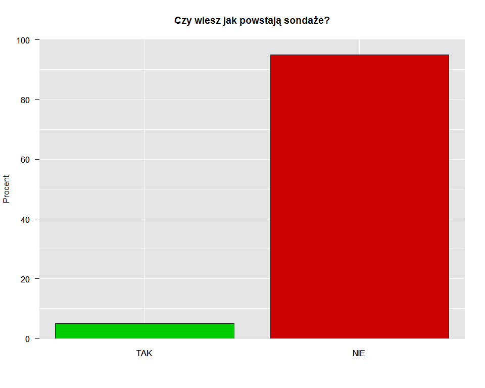
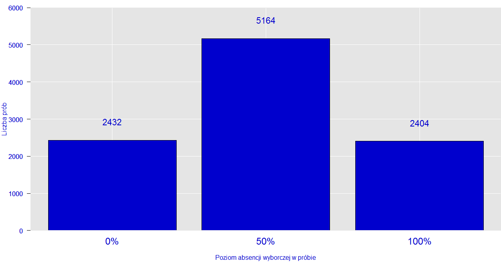
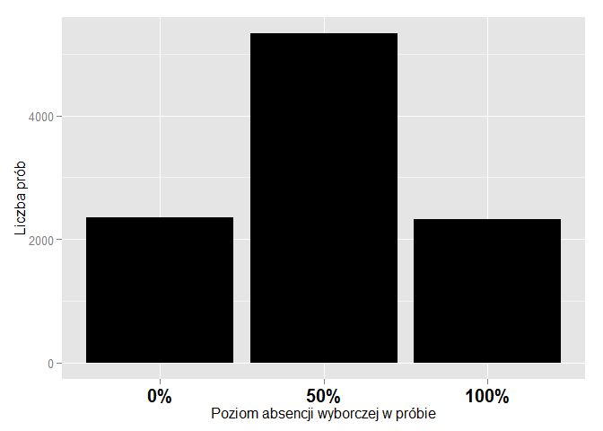
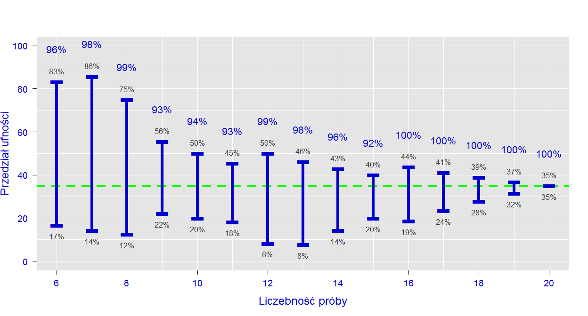
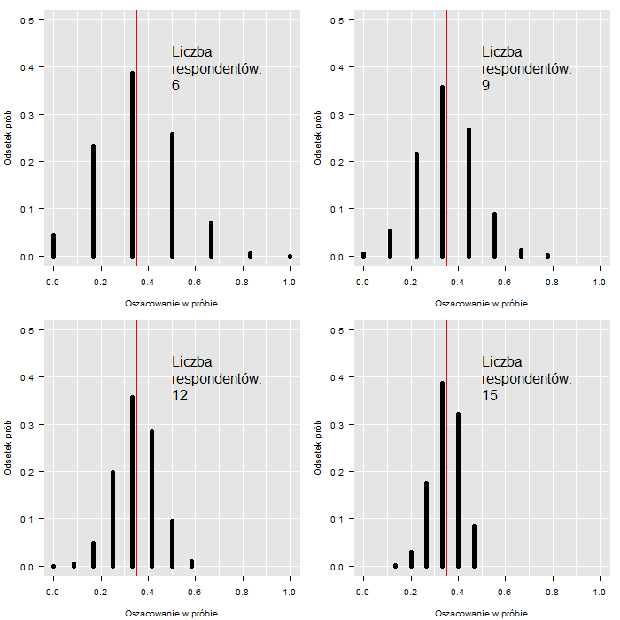
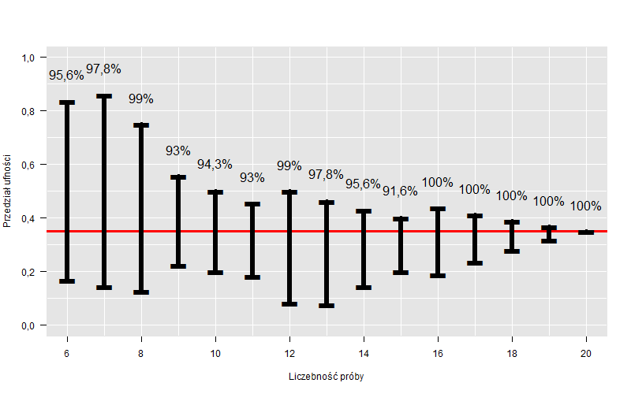
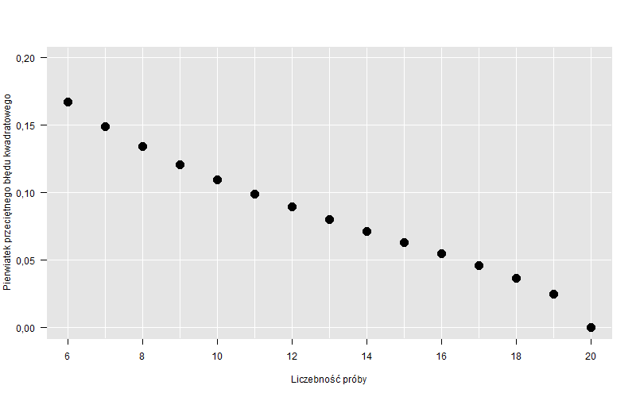
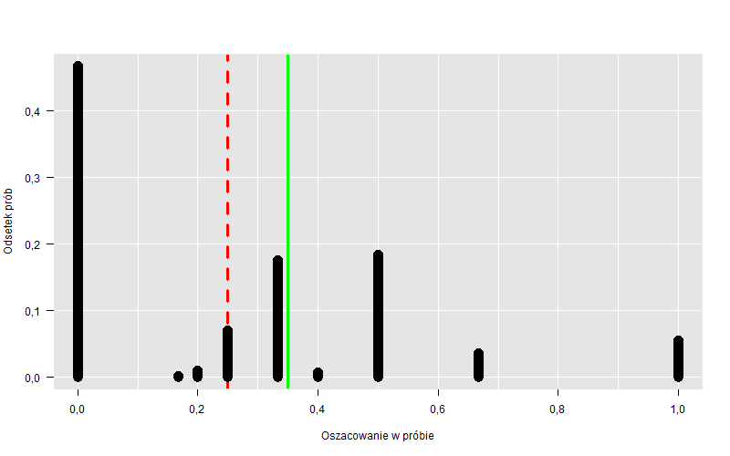

# PogRomcy_Danych_NSS

# 1. Wstęp
Z badań przeprowadzonych przez zespół Na Straży Sondaży w 2014 r. wynika, że 95%
Polaków nie wie jak powstają sondaże!



Jak interpretować ten wynik? Co on oznacza? Odpowiedź jest prosta. Praktycznie nic, bo ta informacja nie ma żadnej wartości. Dlaczego? Nie tylko dlatego, że jest zmyślona. Podstawowy problem stanowi brak jakiejkolwiek noty metodologicznej: nie powiedziałem dokładnie kiedy zorganizowano badanie, jaką techniką je przeprowadzono (telefonicznie czy bezpośrednio), jak zadano pytanie - co to znaczy, że ktoś wie jak powstają sondaże, a także nie zdefiniowałem kim są Polacy - czy są to obywatele, czy mieszkańcy Polski, w jakim byli wieku. Nie podałem również jakim błędem mogą być obarczone wyniki (tzw. błąd statystyczny), ani ile osób wzięło udział w badaniu. Codziennie w prasie i innych mediach pojawiają się podobne “dane sondażowe”. Czy mają one jakąkolwiek wartość? Czy można im zaufać? Jak odróżnić “dobry” sondaż od “złego”.
Na te oraz inne pytania postaramy się udzielić odpowiedzi w trakcie naszego kursu. Pokażemy na czym polega sondaż, z jakich elementów się składa, jakie są jago ograniczenia - czego nie powie nam nawet najlepsze badanie. Zaczniemy od przykładów łatwych, a skończymy na bardziej zaawansowanych próbując wcielić się na chwilę w rolę “sondażyst”. W imieniu zespołu Na Straży Sondaży zapraszamy do odkrywania niezwykłych możliwości, ale także pewnych ograniczeń metody zwanej reprezentacyjną, metody która stoi za wszystkimi sondażami.

__Zadania 1:__  

  1. Wymień trzy artykuły prasowe z 2014 r., w których powołano się na wyniki badań społecznych (sondaży). Jeżeli w artykule podano taką informację to napisz ile osób brało udział w badaniu (ewentualnie ile firm lub innych instytucji jeżeli badanie nie dotyczyło postaw ludzi)


L.p.          | Tytuł artykułu| Link do strony z artykułem | Czy podano wielkość próby? Zapisz ją jeżeli została podana | Czy podano dokładną datę realizacji badania? Jaką?
------------- | --------------|----------------------------|----------------------------------------------------------------|-----------------------------------------------------
1.            |               |                            |
2.            |               |                            |
3.            |               |                            |

# 2. Metoda reprezentacyjna

Na pierwszy rzut oka badanie sondażowe, badanie na próbie, może się wydawać zadaniem karkołomnym. Oto na podstawie niewielkiej liczby obserwacji np. 1000 respondentów, staramy się opisać dużo większą, czasami nawet o kilka rzędów, populację. Czy ma to jakikolwiek sens? Czy da się wyznaczyć na tej podstawie przeciętną wagę, wzrost, miesięczne wydatki, liczbę przeczytanych książek albo czas spędzany dziennie na facebooku przez dorosłych mieszkańców Polski. Trzeba wiedzieć, że oficjalnie mieszka około 31 mln ludzi w wieku 18 i więcej lat. W tej sytuacji 1000 osób stanowi w zaokrągleniu trzy dziesięciotysięczne PROCENTA populacji (1 000 /31 000 000 = 0,000032)!!! To bardzo mało. Trudno uwierzyć, że taka garstka obserwacji może dostarczyć nam wiarygodnych informacji o całej badanej zbiorowości. Dla porównania zastanówmy się, czy na podstawie jednego kilometra drogi da się powiedzieć, jak będzie wyglądała cała podróż mierząca 300 000 km (Ziemia w obwodzie liczy tylko 40 000 km). Na pierwszy rzut oka nie. Okazuje się jednak, że nauka, pod postacią statystyki, daje nam pewne narzędzia, które pozwalają trafnie wnioskować o dużych “obiektach” nawet na podstawie ich niewielkiego wycinka. W przypadku podróży kluczem do sukcesu byłoby umiejętne wybranie takich małych odcinków z całej drogi, które ułożą się w próbny kilometr.
Statystycy i badacze społeczni wiedzą doskonale, że dobrze dobrana próba stanowi świetny opis całej populacji. Jak to możliwe? Co trzeba zrobić, żeby przy użyciu małego kamyka dowiedzieć się czegoś o wielkiej "górze"?

__Zadania 2:__      

  1. Wymień trzy badania na próbach przeprowadzone przez instytucje państwowe  i podaj link do ich wyników lub raportu. Mogą to być badania z roku 2014, ale także wcześniejszych lat. 

L.p.          |Nazwa instytucji | Tytuł badania  | Link do strony z raportem 
--------------|-----------------|----------------|----------------------------
1.            |                 |                |
2.            |                 |                |
3.            |                 |                |

# 3. Przykłady prób

Zacznijmy od naszych codziennych doświadczeń. Wbrew pozorom większość naszej wiedzy o świecie czerpiemy z prób. I nie chodzi tu o metodę prób i błędów. Przyjrzyjmy się naszemu zdrowiu. Czasami zdarza się, że lekarz każe nam zrobić badanie krwi. Ale czy to oznacza, że trzeba zbadać całą krew w organizmie, wszystkie komórki? Na szczęście nie. Wystarczy mała próbka. Lekarz pobiera od nas zaledwie 10 ml krwi. W całym organizmie mamy jej aż 4,5l (4500ml). Tak więc próba stanowi 1/450. całej objętości krwi. To bardzo bardzo mało. Mimo to lekarz potrafi określić, co dzieje się w całym organizmie, a nie tylko w pobranej próbce. 
Weźmy inny, mniej dramatyczny przykład. Wyobraźmy sobie, że chcemy ugotować zupę i lubimy, gdy jest ona odpowiednio słona. Jak to sprawdzamy? Czy musimy wypić całą zupę z garnka? Absolutnie nie. Wystarczy jedna łyżeczka, która zawiera 15ml zupy i stanowi zaledwie 3/1000 pięciolitrowego garnka. Znowu dobraliśmy niewielką próbkę, żeby zbadać większą całość. Ale przypadek zupy jest szczególny. Żeby przekonać się, czy zupa jest odpowiednio słona, musimy ją najpierw dobrze WYMIESZAĆ. Tylko wtedy proporcja soli w łyżce zupy, będzie taka sama jak proporcja w całym garnku - łyżka zupy będzie dobrze reprezentować całą zupę. Kluczową kwestią jest więc REPREZENTATYWNOŚĆ PRÓBY.  Na pewno niektórzy słyszeli już to pojęcie. Zapamiętajmy je na chwilę, chociaż później będziemy musieli z niego zrezygnować. Reprezentatywność można rozumieć na różne sposoby. Często mówi się, że tak jak w przypadku łyżki zupy, próba musi być “miniaturą” populacji. Innymi słowy powinna odtwarzać strukturę i zależności obserwowane w całej zbiorowości. W przypadku badania krwi lub zupy brzmi to sensownie. Zauważmy jednak, że badane substancje są “jednorodne”. Każda porcja zupy czy krwi jest właściwie identyczna (dla uproszczenia, bo specjaliści z pewnością powiedzą, że to nie jest takie proste). A co jeśli badana zbiorowość nie jest i nie może być jednorodna? To problem, z którym bardzo często mierzą się nauki społeczne.

__Zadania 3:__      

  1. Podaj przykład z życia codziennego badania na próbie (np. badanie ilości soli w zupie). 

L.p.          |Czego dotyczy badanie? | Co jest próbą?  
--------------|-----------------------|----------------
1.            |  Opis badania         | Opis próby          
2.            |  Opis badania         | Opis próby      
3.            |  Opis badania         | Opis próby      

# 4. Sondaż 

Przejdźmy do badań społecznych i tzw.  sondaży politycznych. Ich wyniki często pojawiają się w prasie i mają duże znaczenie dla polityków oraz pewnie trochę mniejsze dla wyborców.  Wyobraźmy sobie, że chcemy zmierzyć poziom poparcia dla wybranej partii X w wyborach do parlamentu. Dla naszych celów odsłońmy kilka faktów dotyczących badanej zbiorowości:

|       | Nie biorę udziały w wyborach | NIE |  Tak | Razem |
|-------|------------------------------|-----|------|-------|
|Miasto | 30                           | 5   | 25   | 60    |
|Wies   | 20                           | 10  | 10   | 40    |
|RAZEM  | 50                           | 15  | 35   | 100   |

W powyższej tabeli umieściliśmy procentowy rozkład dwóch cech w populacji pełnoletnich  mieszkańców Polski (dane fikcyjne). Pierwszą cechą jest miejsce zamieszkania (w wierszach), a drugą poparcie dla partii X (w kolumnach). Widzimy, że w miastach mieszka 60% ludności, a na wsi 40%. Łącznie w całej zbiorowości (RAZEM) 35% obywateli zagłosowałoby na partię X, 15% na inną partię, a 50% w ogóle nie wzięłoby udziału w wyborach. Możemy również powiedzieć, że osoby mieszkające w mieście i popierające partię X stanowią 25% ogółu  uprawnionych do głosowania, a także że osoby które mieszkają na wsi i nie biorą udziału w wyborach stanowią 20% populacji. Oczywiście, w normalnych warunkach tego typu informacje są niedostępne dla badacze. My je “odsłaniamy” potrzeby kursu. 
 
Zastanówmy się jak z powyższej populacji dobrać próbę reprezentatywną, aby móc trafnie na jej podstawie ocenić, jaki procent mieszkańców Polski popiera partię X?
I tu pojawia się pierwszy problem. Nie da się bowiem “wymieszać” obywateli tak jak zupy. Zbiorowość nie jest jednorodna. Preferencje wśród mieszkańców miast i wsi nie są identyczne. Nie ma więc gwarancji, że jeśli idąc ulicą w mieście lub na wsi zapytamy dowolnych 10 osób o ich preferencje partyjne to będziemy mogli powiedzieć jakie jest poparcie w całym kraju. W uproszczeniu w mieście 4 na 10 osób zagłosowałoby na  (bo 25%/60%???0,4), a na wsi 1 na 4 (bo 10%/40%=0,25). W pierwszym przypadku poparcie będzie zawyżone, a w drugim zaniżone, w stosunku do ogólnokrajowych wyników (35%). Widać więc, że nie każda próba będzie “REPREZENTATYWNA”. I tu zatrzymajmy się znowu przy definicji REPREZENTATYWNOŚCI. Zauważmy, że zależy nam na tym, aby wynik z próby był zgodny z tym co obserwujemy w populacji. Czyli w zasadzie nie musi być tak, że próba jest miniatura populacji. Ważniejsze jest to, że na jej podstawie prawidłowo odgadujemy wyniki dla całej zbiorowości.
Żeby przeprowadzić nasz polityczny sondaż musimy zrealizować badanie zarówno na wsi jak i w mieście. Każda osoba należąca do populacji musi mieć szansę znalezienia się w próbie. To bardzo ważne. Sposób dobierania próby, zwany schematem, nie może uniemożliwiać nikomu znalezienia się w próbie. 
W dalszej części kursu pokażemy jak prawidłowo zdefiniować populację, jak błędy w kwestionariuszu mogą wpłynąć na zachowanie respondentów, jak dobrać, a dokładnie wylosować próbę reprezentatywną, 

__Zadania 4:__      

  1. Czy w przypadku badania populacji mieszkańców Polski, wyniki sondy ulicznej przeprowadzonej w Warszawie, Krakowie lub Poznaniu można uznać za wiarygodne (dające się uogólnić na całą populację)?
  2. Na podstawie danych z Tabeli 1. POPULACJA WYBORÓW odpowiedz na poniższe pytania:     
    a. Jaki procent mieszkańców wsi popiera ?    
    b. Jaki procent mieszkańców miasta nie pójdzie na wybory?    
    c. Jaki procent osób które nie popierają partii X mieszka w mieście?

# 5. Problem badawczy -> populacja -> technika
Co powinien zrobić każdy prawdziwy sondażysta przed rozpoczęciem badania? Powienien odpowiedzieć sobie na  trzy podstawowe pytania.   

1.  **Jak zdefiniować problem badawczy?**     

W przypadku badań sondażowych to pytanie możemy uściślić w następujący sposób: jaką cechę naszej zbiorowości chcemy zmierzyć. Co rozumieć przez cechę w tym przypadku? Opisując duża zbiorowość musimy zdecydować się na jakiś kompromis i uogólnienia. Sondaż nie odpowie nam na pytanie, jak zachowują się poszczególni mieszkańcy Polski. Możemy natomiast za jego pomocą określić, jak zachowują się przeciętnie albo jak zachowuje się większość z nich. Sondaż pozwala więc badać parametry, cechy, populacji takie jak średnia (np. waga) lub odsetek osób w pewien sposób wyróżnionych(np. odsetek osób uczestniczących w wyborach). 
Najczęsciej sondaże realizuje się, aby poznać preferencje wyborcze obywateli. Problemem badawczym może być jednak także coś innego. Wiele sondazy służy ocenie  przeciętnych dochody, wydatków, a także preferencji konsumenckich w danej grupie społecznej. 
Określenie problemu badawczego stanowi punkt wyjścia do następego pytania.

2.  **Jak zdefiniować badaną populację? O jakiej zbiorowości chcemy wnioskować?**   

Załóżmy, że interesuje nas populacja Polaków. Czy to znaczy, że będziemy badać wszystkich ludzi na świecie posiadających obywatelstwo polskie albo mówiących po polsku? A może tylko tych spośród nich, którzy mieszkają w kraju? Albo ogólnie mieszkańców Polski niezależnie od tego, czy posiadają obywatelstwo czy też nie?    
Musimy również zadecydować, czy interesują nas ludzie w każdym wieku, czy może tylko pełnoletni z prawem do głosowania (18+)? Lub też osoby w wieku produkcyjnym i poprodukcyjnym (15+)? 
Najczęściej sondaże w Polsce obejmują populację pełnoletnich obywateli zamieszkałych na terenie kraju. Istnieją jednak badania społeczne dla których, ze względu na poruszaną problematykę, populacje definiuje się zupełnie inaczeć. I tak istnieją badania zbiorowości osób w wieku dokładnie 15 ukończonych lat, albo zbiorowości pełnoletnich obywateli województwa małopolskiego.
Określenie problemu badawczego i zdefiniowanie populacji to nie wszystko. Trzeba bowiem jeszcze dostosować do nich sposób w jaki pozyskiwane będa dane od respondentów.

3.  **Jaką technikką zrealizować badanie?**   

Trudno sobie bowiem wyobrazić badanie dochodów mieszkańców Polski przeprowadzone przy pomocy ankiety internetowej. Dalece bowiem nie wszyscy członkowie tej zbiorowości są w łączności z "globalną siecią". Bywają oczywiście sytuacje, w których stosowanie takiej metody jest uzuasadnione i z pewnością w przyszłości, wraz z poprawą dostępu do sieci, zdominuje ona badania sondażowe.  Jak narazie jednak ankiety internetowe funkcjonują w cieniu dwóch innych częściej stosowanych metod zbierania danych. Ogólnie możemy więc wyróżnić trzy następujące grupy technik realizowania badań sondażowych: 

  1. Wywiady bezpośrednie;   
  2. Wywiady telefoniczne;    
  3. Ankiety internetowe. 

Wywiady "bezpośrednie" są realizowane w "terenie", najczęściej w miejscu zamieszkania losowo dobranych respondentów. Pozwalają on dotrzeć do największej grupy ludności, nieosiągalnej poprzez połączenie telefoniczne, bądź przez internet. Tego typu technikę często stosuje się w badaniach ogólnopolskich, dotyczących populacji mieszkańców całego kraju. Metoda bezpośrednia wiąże się z dużymi kosztami oraz długim okresem realizacji. Ankieterzy musza bowiem dotrzeć osobiście do wszystkich respondentów. Czasami pokonują w tym celu kilkadziesiąt kilometrów. Zdaża się bowiem, że  odległości między poszczególnymi respondentami są bardzo duże. Co więcej, respondenci bywają nieuchwytni i w związku z tym, aby się z nimi skontaktować, trzeba wielokrotnie ponawiać wizyty. Sondaze bezpośrednie wymagają więc dużych nakładów pracy. Mają one jednak jedną poważną zaletę. Są nią ankieterzy. Dzięki nim respondenci chętniej biorą udział w badaniu. Odsetkiem odmów wzięcia udziału w sondażach realizowanych metodą bezpośrenią jest stosunkowo niski. Respondentom trudniej jest odmówić ankieterowi, który odwiedza ich bezpośrednio, niż takiemu który kontaktuje się z nimi telefonicznie.  

Wywiady telefoniczne to zupełnie inna bajka. Obecnie jest to jedna z najczęściej wykorzystywanych metod zbierania danych. Jej popularność wynika  przede wszystkim z niskich kosztów oraz krótkiego czasu realizacji. Łatwiej jest bowiem przeprowadzić 1000 rozmów telefonicznych niż zorganizować 1000 spotkań z respondentami. Sami jednak wiemy, jak takie badania wyglądają w praktyce: „przepraszam, nie mam czasu” albo „już brałem udział w tym badaniu” przychodzi nam przez telefon dużo łatwiej, niż podobne zachowanie w bezpośredniej konfrontacji z ankieterem. Nic więc dziwnego, że w tego rodzaju badaniach tylko co dziesiąty telefon kończy się zrealizowanym wywiadem. Dla porównania technika bezpośrednia pozwala zrealizować wywiad z co trzecią dobraną do próby osobą. 
Poważnym ograniczeniem badań telefonicznych jest to, że mogą one być relizowane tylko w odniesieniu do populacji, której członkowie posiadają telefony. CO więcej Wywiady telefoniczne  musza być w miarę krótkie ponieważ resopndenci nie lubią długo "wisieć" na telefonie. W związku z tym konieczne jest równiez ograniczenie liczby pytań w ankiecie, a co za tym idzie ograniczenie liczby możliwych do przeprowadzenia analiz.  

Ostatnia grupa technik to wspomniane wcześniej ankiety internetowe. Nie chodzi tu o sondy umieszczane na stronach WWW, ale o badania, w których "sondazysta" wybiera respondentów np. wysyłając im maile z kluczem do ankiety umieszczonej w sieci. Tego typu techniki budzą wiele kontrowersji, szczególnie gdy są wykorzystywane do wnioskowania o populacjach, takich jak mieszkańcy Polski. Wiadomo bowiem, że nie wszyscy członkowie takiej zbiorowości posiają komputer i wiedzą jak korzystać z Internetu. Innymi słowy jest to technika wykluczająca duże grupy społeczne, prawdopodobnie większe niż w przypadku badania telefonicznego. W związku z tym trudno jest mówić o reprezentatywności wyników w tym przypadku. Powodem dla którego realizuje się tego rodzaju badania jest koszt, niewątpliwie niższy niż w przypadku wywiadów bezpośrednich czy telefonicznych. 

Aby łatwiej rozróżniać poszczególne metody zbierania danych sondażyści, nadali im specjalne oznaczania. Można się na nie natkąć w artykułach prasowych lub w notach metodologicznych różnych badań. Poniżej znajduje się tabela z obajaśnieniami oznaczeń czterech najczęsciej sotosowanych technik zbierania danych wraz z ich oznaczeniem. 

### Tabela 5.1. Techniki realizacji badań

| Technika | PAPI (Paper And Pencil Interviewing)                                                                                                         | CAPI,(ComputerAssisted Personal Interviewing)                                                                                                                                                | CATI (Computer Assisted Telephone Interviewing)                                                                                                                                                                  | CAWI (Computer Assisted Web Interviewing)                                                                             |
|----------|----------------------------------------------------------------------------------------------------------------------------------------------|----------------------------------------------------------------------------------------------------------------------------------------------------------------------------------------------|------------------------------------------------------------------------------------------------------------------------------------------------------------------------------------------------------------------|-----------------------------------------------------------------------------------------------------------------------|
| Opis     | Wywiad bezpośredni - respondent dostaje od ankietera kartkę z pytaniami, bierze ołówek lub długopis i zapisuje (zaznacza) swoje odowiedzi;   | Wywiad bezpośredni - ankieter przychodzi do repondenta z laptopem (lub innym urządzeniem mobilnym) i odczytuje ze specjalnego programu pytania, a nasępnie zapisuje w nim odpowiedzi.        | Wywiad telefoniczny - ankieter dzwoni pod losowo wybrany numer telefonu i osobie, która odbierze, zadaje pytania z przygotowanego kwestionariusza. Odpowiedzi są zapisywane w specjalnym programie komputerowym. | Ankieta internetowe - brak ankietera, respondent wypełnia kwestionariusz samodzielnie na stronie internetowej. |
| Zalety   | * możliwość stosowania techniki do bardzo różnych populacji; * stosunkowo niski odsetek odmów wzięcia udziału w badaniu;                     | * możliwość stosowania techniki do bardzo różnych populacji; * stosunkowo niski odsetek odmów wzięcia udziału w badaniu; * możliwość gromadzenia danych bezpośrednio w systemie komputerowym | * bardzo szybka realizacja; * stosunkowo niskie koszty; * możliwość gromadzenia danych bezpośrednio w systemie komputerowym                                                                                      | * bardzo niskie koszty; * możliwość gromadzenia danych bezpośrednio w systemie komputerowym                           |
| Wady     | * wysokie koszty; * długi czas realizacji; * konieczność przepisywania wyników z ankiety papierowej do systemu komputerowego - możliwe błędy | * wysoki koszt; * długi czas realizacji;                                                                                                                                                     | * duży odsetek odmów wzięcia udziału w badaniu; * ograniczone zastosowanie techniki                                                                                                                              | * bardzo ograniczone zastosowanie techniki;                                                                                                                     |

Szczególnie istotną cechą różnicującą opisane powyżej techniki jest tak zwany poziom realizacji próby (nazywany również poziomem response-rate), czyli odsetek osób wytypowanych przez nas do udziału w badaniu, z którymi faktycznie udało się przeprowadzić wywiad. Warto wiedzieć, że praktycznie nigdy nie występuje sytuacja, w której sondażystom udaje się zapytać o opinię wszystkie osoby dobrane przez nich do próby. Dzieje się tak z kilku powodów. Po pierwsze, nie do wszystkich osób udaje się dotrzeć/dodzwonić. Powodem mogą być choroby,wakacje, delegacje służbowe itp. Ponadto część osób, do których uda się dotrzeć, z różnych przyczyn odmawia wzięcia udziału w badaniu.  Oba te czynniki są dodatkowym źródłem błędu w badaniu i celem każdego dobrego badacza jest ich zminimalizowanie. Jest to kolejny powód dla które technika zbierania danych ma tak istotne znacznie.  

Problem poprawnego zdefiniowania populacji oraz dobrania do niej odpowiedniej techniki badawczej dobrze ilustruje przykład historyczny. W 1936 roku „Literary Digest”, popularny magazyn informacyjny przeprowadził w USA badanie przedwyborcze. Do ludzi wybranych z książek telefonicznych i list rejestracyjnych samochodów wysłano DZIESIĘĆ MILIONÓW kart pocztowych, pytając, na kogo zamierzają oddać głos w wyborach prezydenckich – na republikanina Alfa Landona czy demokratę Franklina Roosevelta? Odpowiedziało ponad dwa miliony ludzi, wskazując że nowym prezydentem wybrany zostanie Alf Landon (57%), a nie Franklin Roosevelt (43%). Mogłoby się wydawać, że przebadanie tylu osób jest dużo bardziej wiarygodne i miarodajne niż przeprowadzenie badania na niewielkim wycinku populacji. Nic bardziej mylnego. Realne wybory dość drastycznie zweryfikowały wnioski z tych badań – nowym prezydentem został Franklin Roosevelt, mając największą przewagę głosów w historii – otrzymał 61%.
Dla porównania w tym samym czasie przedwyborczy sondaż, przeprowadził również  George Gallup, który trafnie przewidział wyniki wyborów. W swoim badaniu posłużył się on jednak niewielką próbą kwotową (czyli opartą na znajomości określonych cech populacji, np. płeć, dochód, wiek, miejsce zamieszkania itp.).
Na czym więc polegał problem? Na całkowitym braku kontroli nad badaną próbą. Na pytanie zadane przez „Literary Digest” odpowiedziało zaledwie 22% wszystkich zapytanych osób. Jak się okazało karty w większości odsyłali republikanie. Drugi problem polegał na nieprawidłowym zdefiniowaniu populacji. Respondenci do badania zostali dobrani na podstawie spisu abonentów telefonicznych i właścicieli samochodów. Taka konstrukcja próby dawała nadreprezentację zamożnych wyborców, czyli pominięcie ludzi biednych, którzy w większości głosowali na „New deal” Roosevelta. 
Przykład ten ilustruje, jak dobór nawet dużej próby z niepoprawnie zdefiniowanej populacji może doprowadzić do zupełnie nietrafnych wniosków.  Analizując wyniki badań sondażowych należy zawsze zwracać uwagę na sposób definiowania populacji oraz technikę realizacji badania. Definicja zbiorowości generalnej powinna zawierać informacje o: 

* położeniu w przestrzeni zbiorowości (mieszkańcy Polski, mieszkańcy Poznania itp.)  
* wieku respondentów (pełnoletni Polacy, osoby w wieku 15 i więcej ukończonych lat itp.)   
* inne cechy (osoby posiadające obywatelstwo polskie, osoby z wykształceniem wyższym itp.)

__Zadania 5:__      

  1. Wymień trzy firmy zajmujące się badaniem rynku i opinii społecznej, które w 2014 r. prowadziły badania sondażowe w Polsce i podaj link do strony z raportami badawczymi tej firmy: 
  
L.p.          | Nazwa firmy badawczej| Link do strony z raportem?  
--------------|----------------------|----------------
1.            |  Nazwa firmy         | Raport          
2.            |  Nazwa firmy         | Raport     
3.            |  Nazwa firmy         | Raport     

  2. Masz następujący problem badawczy. Musisz zbadać poziom czytelnictwa tygodnika Na Straży Sondaży. Ukazuje się wyłącznie w formie drukowanej w miastach wojewódzkich (siedzibach wojewody). Pismo jest przeznaczone dla wszystkich, niezależnie od wykształcenia czy wieku.   
    a. Jak zdefiniujesz czytelnictwo? ( Pytania pomocnicze: Kiedy ktoś staje się czytelnikiem? Jak często trzeba czytać żeby stać się czytelnikiem? Ile trzeba przeczytać żeby stać się czytelnikiem?)   
    b. Jak zdefiniujesz populację czytelników? (Pytania pomocnicze: jaki jest minimalny wiek czytelnika? czy czytelnicy mieszkają tylko w miastach wojwódzkich czy także w innych miejscach?)   
    c. Zapisz pytanie o czytelnictwo (maksymalnie dwa zdania):........    
    d. Czy twoim zdaniem pytanie o czytelnictwo może być uznane za drażliwe?
  3. W 2013 r. Dom Badawczy Maison przygotowała na zlecenie Polskiej Fundacji Pomocy Dzieciom „Maciuś” raport pt.:“Głód i niedożywienie dzieci w Polsce”. Został on przygotowany na podstawie badanie przeprowadzono telefonicznie (technika CATI - Computer Assisted Telephone Interview) na ogólnopolskiej, reprezentatywnej próbie 800 przedstawicieli instytucji zajmujących się dziećmi i ich sytuacją życiową. Z raportu wynika, że pracownicy szkół i pracownicy OPS/PCPR szacują, że co dziesiąte dziecko z klas 1–3 dotyka problem niedożywienia.   
    a. Zdefiniuj badaną populację.
    b. Podaj liczbę uczniów klas 1-3 w Polsce w 2013 r.(mogą to być dane zgodne ze stanem na 1 czerwca 2013 r. lub dla późniejszej daty przed końcem 2013 r.)
    c. Maksymalnie w trzech zdaniach napisz co rozumiesz przez niedożywienie
    d. Czy z danych przedstawionych w raporcie może wynikać, że w Polsce z głodu cierpi około 800 000 dzieci? Odpowiedź uzasadnij.
    
  4. Uniwersytecki Zespół Na Straży Sondaży zamówił badanie dotyczące popularności strony internetowej “www.nastrazysondazy.uw.edu.pl”. Chodziło oszacowanie odsetka osób w wieku 18-35 lat zamieszkałych w Polsce, które w ciągu ostatniego miesiąca zapoznały się z treścią (przeczytały cały lub prawie cały) przynajmniej jednego artykułu na stronie. Badanie zostało przeprowadzone metoda CAWI przez firmę “Polski Panel Internetowy” na próbie 917 osób w wieku 18-35 lat spośród 50 tys. osób które dobrowolnie zarejestrowały się do bazy internetowej firmy i za drobna opłatą zgadzają się odpowiadać na pytania w różnych ankietach. Wiadomo również, ze osoby do badania zostały dobrane w ten sposób, aby rozkład płci wieku oraz wielkości miejscowości deklarowenego zamieszkania był zgodny z danymi podawanymi przez GUS na temat mieszkańców Polski. Odpowiedz na pytania związane z tym badaniem:
    a) Czy populacja osób z posiadających dostęp do internetu (korzystających z internetu do celów prywatnych w domu, bibliotece, pracy lub szkole/uczelni) obejmuje wszystkich mieszkańców Polski?     
      i. Tak;   
      ii. Nie - Nie wszyscy mieszkańcy Polski mają dostęp do Internetu - sprwdż dane GUS.    
    b) Czy próba badawcza 917 osób została dobrana z populacji polskich internautów - osób korzystających z internetu do celów prywatnych (nie związanych z praca zarobkowa, ale np. komunikacją ze znajomymi i rodziną, nauką, czytaniem prasy, graniem, oglądaniem fimów, robieniem zakupów itp.)  w domu, kawiarence internetowej, bibliotece, pracy lub szkole/uczelni?   
      i. Tak    
      ii. Nie - próba została dobrana spośród 50 tys. osób, które same zgłosiły się do udzielania odpowiedzi na pytania ankietowe przez Internet. Choć jest to mało prawdopodobne można sobie wyobraźić, że w próbie mogł znaleźć się  kogoś kto korzysta z Internetu tylko w celach zarobkowych, w tym do wypełniania ankiet za pieniądze. Zgodnie z nasza definicją taka osoba nie jest internautą.    
    c) Czy badanie zlecone przez Na Straży Sondaży obejmuje popluację polskich internautów.    
      i. Tak - badanie dotyczy oszacowania odsetka wśród mieszkańców Polski ogółem nie tylko internautów. Musimy jednak pamiętać, że Polscy internauci nie maja   ponieważ pytanie dotyczy  odwiedziania strony “Na strazy sondaży”. Nie mozna odwiedzić strony internetowej nie będąc    
      ii. Nie.  
    d) Czy badanie zrealizowne przez “Polski Panel Internetowy” obejmuję populacje;   
    e) Czy rozkład płci, wieku i wielkości miejscowości zamieszkania w próbie jest zgodny z rozkladem tych cech w populacji mieszkańców Polski?    
      i. Tak    
      ii. Nie - rozklad jest zgodny z danymi GUS dotyczącymi populacji mieszkańców Polski, a nie polskich internautów.    
    
    
# 6. Kwestionariusz

Mając wybrany problem badawczy i dobraną do niego odpowiednią technikę zbierania danych możemy przejść do kolejnego elementu sondażu, a więc kwestionariusza. Choć rzadko się o tym mówi jego konstrukcja ma ogromne znaczenie dla wyników badania. Ilustruje to dobrze klasyczny już przykład eksperymentu opisanego przez Schumana, zrealizowanego w 1986 roku w Stanach Zjednoczonych. Badacze z Uniwersytetu Michigan zapytali o najważniejsze wydarzenia lub zmiany, jakie zaszły w ostatnich 50 latach i wydają się respondentom najbardziej istotne. Połowa ankietowanych miała do dyspozycji następującą listę odpowiedzi:  

* II wojna światowa, 
* podbój kosmosu, 
* zabójstwo J. F. Kennedy’ego, 
* wynalezienie komputera, 
* wojna w Wietnamie, 
* inne, 
* nie wiem. 

W pierwszej grupie aż 30% respondentów wybrało wynalezienie komputera jako najbardziej istotne wydarzenie lub zmianę ostatnich 50 lat. Wśród pozostałych osób podobnej odpowiedzi udzielił zaledwie 1% ankietowanych. Ta agromna różnica najlepiej popazuje, jak wiele zależy od formy zadawanych pytań.

To jednak nie wszystko. Na sposób udzielania odpowiedzi przez respondentów wpływ ma nie tylko konstrukacja pytań ale także użyty w nich język. Dlatego kwestionariusz powinien odnosić się do rzeczywistości w sposób neutralny, bez sądów czy sugerowania, które odpowiedzi są "dobre".

Czasami jednak kontrowersje są nie do uniknięcia. Dotyczy to tzw. kwestii drażliwych. Stanowią one poważny problem dla sondażystów. Respondenci raczej niechętnie udzielają odpowiedzi na pytania dotyczające ich intymnych spraw.  Trudno im się przyznać do problemów z nałogami, do niewierności w związku czy popełnonych przestępstw. Zazwyczaj w takich sytuacjach nawet gwarancja anonimowości nie jest wystarczającą "zachętą" dla respondentów, aby udzielac szczerych odpowiedzi.

Więcej o problemach związanych z kwestiami drażliwymi i sposobach radzenia sobie z nimi możecie przeczytać na naszych stronach stronie:

1. http://nastrazysondazy.uw.edu.pl/know-how-pytan-o-kwestie-drazliwe-czyli-jak-zachecic-badanych-do-szczerych-odpowiedzi/   

2. http://nastrazysondazy.uw.edu.pl/know-how-pytan-o-kwestie-drazliwe-cz-2-techniki-niebezposrednie/

__Zadania 6:__      

  1.  Odpowiedz na pytania związane z następującym badaniem: Firmę Research.NK przygotowała w 2013 r. raport „Prezentacja treści seksualnych przez młodzież poprzez wideoczaty” dla Naukowej Akademickiej Sieci Komputerowej. Dane zostały zebrane od respondentów przez Internet. Próba liczyła 976 nastolatków - osób w wieku 13-16 lat. Spośród nich  528  zdeklarowało, że korzysta z wideo rozmów. W tej grupie 10 osób zadeklarowało, że  rozbiera się w sieci na żywo (Pytanie brzmiało: „Czy zdarzyło Ci się rozbierać się lub prezentować zachowania seksualne podczas wideorozmowy?” ). Wiadomo również, że w badaniu wzięło udział 157 szesnastolatków, z czego 96 z nich korzysta z wideo rozmów, a 5 deklaruje rozbieranie się w czasie . 
    a. Czy uważasz, że respondenci generalnie (a wiec przytłaczająca większość z nich) udzielali szczerych (zgodnych ze stanem faktycznym), odpowiedzi na pytanie o to, czy rozbierali się w trakcie wideoczatów - zarówno Ci którzy przyznali się do tego typu zachowań jak i ci którzy ich nie potwierdzili?  
      i. Tak - generalnie odpowiadali szczerze;   
      ii. Nie - generalnie odpowiadali nieszczerze;   
      iii. Nikt tego nie wie. Może część tak, a część nie.   
      iv. Jestem dzielna/y i napiszę jakie jest moje własne zdanie na ten temat : ...  
    b. Czy uważasz, że badanie przez Internet daje większe poczucie anonimowości niż klasyczne badania prowadzone przez telefon lub twarzą w twarz z ankieterem? Uzasadnij maksymalnie w trzech zdaniach.
      i. Tak, ponieważ ...
      ii. Nie. ponieważ ...
    c. Czy uważasz, że badanie przez Internet daje większe poczucie anonimowości niż klasyczne badania prowadzone przez telefon lub twarzą w twarz z ankieterem? Uzasadnij maksymalnie w trzech zdaniach.   
      i. Tak, ponieważ ...   
      ii. Nie. ponieważ ...    
    d. Czy w badaniu przeprowadzonym przez internet byłabyś / byłbyś skłonny odpowiadać szczerze na pytania dotyczące seksualności, chorób intymnych lub łamania prawa? Dlaczego? (Pytania pomocnicze: zastanów się, czy ważna w tych kwestiach jest anonimowość i poufność danych, a także, czy w ogóle mówienie na ten temat sprawia Ci jakieś problemy):
      i. Tak, ponieważ ...    
      ii. Nie, ponieważ ...    
    e. Jaki procent nastolatków w powyższym badaniu zadeklarował, że korzysta z wideo rozmów i rozbiera się w ich trakcie?
    f. Jaki procent osób które zadeklarowały, że rozbierają się w trakcie wideoczatów do 16 latkowie?    
    g. Jaki procent nastolatków, którzy korzystają z wideo rozmów zadeklarował, że się rozbiera w ich trakcie?    
    h. Czy znając wyniki badania zgodziłabyś/zgodziłbyś się z następującymi określeniami:    
      i. „Nowa plaga w sieci. Rozbierają się na żywo” - TAK / NIE    
      ii. „Nagie gimnazjalistki w sieci. Nowa plaga w internecie” - TAK / NIE    
      iii. “Nowe zjawisko w internecie. Gizmazjaliści rozbierają się w sieci” - TAK / NIE     
      i.v “Uwaga na wideoczaty. Niektóre nastolatki występują nago”    
  1.  Poniżej znajdują się dwa sondaże. Wypełnił je i odpowiedz na pytania:   
    a. Sondaż 1:   
      i. Czy gdyby wybory odbyły się w najbliższą niedzielę to wziąłby(ęłaby) Pan(i) w nich udział?   
      ii. Jeżeli tak, to na jaką jedną partię odałby Pan(i) głos?   
      
        1. oddam pusty/nieważny głos;    
        2. partię X;   
        3. partię Przyjaciół Demokracji;  
        4. partię Przyjaciół Otwartości;   
        5. partię Przyjaciół Społeczeństwa;   
        6. partię Przyjaciół Środowiska;   
        7. partię Przyjaciół Uczciwości;   
    b. Sondaż 2.
      i. Proszę określić czy zgadza się Pan/Pani z następującymi stwierdzeniami:   
      
        1. Podatki w Polsce są za wysokie i należy je niezwłocznie obniżyć   
        2. ZUS jest organizacją drogą, nieefektywną i marnującą publiczne pieniądze    
        3. Obywatele lepiej będą zarządzać swymi pieniędzmi niż urzędnicy w ich imieniu    
        4. każda rodzina powinna móc liczyć na wsparcie ze strony państwa.     
      ii. Czy słyszał(a) Pan(i) o powstaniu nowej partii “P”, której programem jest m. in. obniżenie podatków, ograniczenie obciążeń biurokratycznych, zmniejszenie liczby urzędników oraz wsparcie dla rodzin?   
      iii. Czy gdyby partia “X” brała udział w najbliższych wyborach do Sejmu to jaką jedną partię oddałby Pan(i) głos?

        1. oddam pusty/nieważny głos;    
        2. partię X;   
        3. partię Przyjaciół Demokracji;  
        4. partię Przyjaciół Otwartości;   
        5. partię Przyjaciół Społeczeństwa;   
        6. partię Przyjaciół Środowiska;   
        7. partię Przyjaciół Uczciwości;  
    c. Pytanie do sondaży 1. oraz 2.:     
      i. Czy w obu sondażach udzieliłaś/eś takiej samej odpowiedzi?    
      ii. Czy twoim zdaniem kolejność pytań w sondażu 1. 2. może mieć wpływ na odpowiedzi respondentów?    
      
# 7. Dobór próby

Mając już określony problem badawczy, wybraną technikę zbierania danych oraz przygotowany, odporny na kwestie wrażliwe, kwestionariusz, możemy przejść do doboru respondentów. W branży sondażowej korzysta się w tym zakresie z różnych rozwiązań, ale tylko jedno jest dobrze opracowne od strony teoretycznej i przy odpowieniej staranności wykonania pozwala rzetelnie wnioskować o populacji. Dlatego też zajmiemy się tylko nim - jest to dobór losowy. Prosty przykłąd doboru losowego pozwoli nam zrozumieć mechanikę wnioskowania o dużych populacjach na podstawie małych prób. 

Zacznijmy od tego, że chcąc dobrać próbę z populacji w sposób losowy musimy mieć "spis" wszystkich osób do niej należących. Musimy mieć z czego wybierać. Taka lista nazywana jest "operatem losowania". Powinna ona zawierać nie tylko informację o tym ile osób znajduje się w populacji, ale także jak można się z nimi "skontaktować", czyli np. gdzie mieszkają. Na szczęście w Polsce istnieją przynajmniej dwa takie operaty, które umożliwiają dobieranie w sposób losowy prób sondażowych. Pierwszy z nich to rejestr __PESEL__ (Powszechny Elektroniczny System Ewidencji Ludności) zawierający spis wszystkich obywateli Polski oraz osób posiadających prawo do pobytu na terenie kraju wraz z danymi o miejscu ich zameldowania. Rejestr ten jest zarządzany przez _Ministerstwo Spraw Wewnętrznych_. Drugim operatem jest __TERYT__ zawierający informację o wszystkich mieszkaniach w Polsce. Za jego pomocą, dobierając mieszkasznia, można dobierać próby mieszkańców Polski. Rejestr ten prowadzi _Główny Urząd Statystyczny_.

Wiemy już czego potrzebujemy, żeby dobrać próbą więc teraz możemy się zastanowić, jak to zrobić. Najlepiej gdy skorzystamy z uproszczoengo przykłądu. Zacznijmy od probmemu badawczego i populacji. Załóżmy, że chcemy oszacować __poziom absencji wyborczaj__ w fikcyjnej populacji wyborców zamieszkałych w Polsce składającej się z 20 osób (korzystaliśmy już z niej wcześniej).  Będzie nam zależało na tym, aby dowiedzięć się, jaki odsetek obywateli deklaruje, że nie pójdzie na wybory (wynosi on 50%, ale na chwile o tym zapomnijmy). Żeby oszacować interesujący nas odsetek zastosujemy technikę wywiadu bezpośredniego, w którym zadamy pytanie: "Gdyby w najbliższą niedzielę odbywały się wybory do Sejmu i Senatu, to czy wziął(ęła)by Pan(i) w nich udział?" Zakładamy, że pytanie to nie jest drażliwe i wszyscy respondenci odpowiedzą na nie zgodnie ze swoim sumieniem. 


### Tabela 7.1. POPULACJA WYBORCÓW (liczba obserwacji)

|       | Nie pójdę na wybory| Nie| Tak| RAZEM|
|:------|-------------------:|---:|---:|-----:|
|Miasto |                   6|   1|   5|    12|
|Wieś   |                   4|   2|   2|     8|
|RAZEM  |                  10|   3|   7|    20|

W powyższej tabeli rozkład liczebności miejsca zamieszkania i odpowiedzi na nasze pytanie badawcze. Widzimy, że w miastach mieszka 12 osób, a na wsi 8. Poparcie dla partii X deklaruje 7 osób, poparcie dla innych partii 3, a na wybory w ogóle nie pójdzie 10 osób. Żeby dibrać próbę potrzebujemy jeszcze operatu losowania. W naszym przypadku wygląda on następująco:


|L.p. |Miasto_wies |Glosowanie |
|:----|:-----------|:----------|
|1    |M           |1          |
|2    |M           |1          |
|3    |M           |1          |
|4    |M           |1          |
|5    |M           |1          |
|6    |M           |0          |
|7    |M           |-1         |
|8    |M           |-1         |
|9    |M           |-1         |
|10   |M           |-1         |
|11   |M           |-1         |
|12   |M           |-1         |
|13   |W           |1          |
|14   |W           |1          |
|15   |W           |0          |
|16   |W           |0          |
|17   |W           |-1         |
|18   |W           |-1         |
|19   |W           |-1         |
|20   |W           |-1         |

Operat można pobrać z następującej strony:

https://docs.google.com/spreadsheets/d/1iSt2ZD9F8DhEh8UonnYqZ71wG7gqm5MSlpiZM2vL-Gw/pubhtml?gid=1189066294&single=true

Dla wyjaśnienia ustalmy, że kolejne kolumny w operacie oznaczają:   

  * L.p.- liczba porządkowa obywatela;
  * Miasto_wies - miejsce zamieszkania obywatela;
    + M - miasto;
    + W - wieś;
  * Glosowanie - czy pójdziesz na wybory i na kogo zagłosujesz;
    + -1 - nie pójdę na wybory;
    + 0 - pójdę na wybory, ale NIE zagłosuję na partię X;
    + 1 - pójdę na wybory i zagłosuję na partię X.
    
Nasz problem badawczy dotyczy absencji wyborczej. Interesuje więc nas odsetek osób, które w kolumnie "Glosowanie" mają warstość -1, a wiec na pytanie o to na kogo zagłosują odpowiadają, że nie wybierają się na wybory.

Przejdźmy do najważniejszego. Mamy problem badawczym, populację, technikę realizacji, kwestionariusz, operat losowania, a więc wszystko co jest nam potrzebne, aby zająć się doborem respondentów.

Dla naszych potrzeb skorzystamy z bardzo uproszczonego sposobu losowania próby. Pozwoli on nam przeanalizować podstawowe zagadnienia z doborem respondentów, a jednocześnie ....................  
Przymiemy następujący __schemta losowania próby__ - w ten sposób sondażyści określają zasady wg których dobierają respondentów: z naszej 20 osobowej populacji będziemy losowali 2 różne osoby w następujących krokach:

  1. Do próby losujemy jedną osobę spośród 20. Każdy obywatel ma takie samo prawdopodobieństwo znalezienia się w próbie - wynosi ono 1/20;   
  2. Spośród pozostałych 19 osób znowu losujemy jednego respondenta. Ponownie w zbiorowości z której dobierany jest respondent każdy ma takie samo prawdopodobieństwo znalezienia się w próbie - wynosi ono tym razem 1/19;    
  3. Otrzymujemy próbę, w której znajdują się dwie osoby. Poza próbą zostaje 18 obywateli.   

Powyższy schamat losowania 2 osób z populacji 20 nazwiemy: __losowaniem prostym bez zwracania__. Losowanie to jest proste ponieważ na każdym etapie wszyscy obywatele pozostający w populacji mają takie samo prawdopodobieństwo dostania się do próby. Bez zwracania ponieważ po wylosowaniu jednej osoby do próby nie wraca ona do puli z której losujemy następną. Ten bardzo prosty schemat losowania próby pozwali nam przeanalizować pewne podstawowe zagadnienia związane z metodą reprezentacyją.    

Zastanówmy się przede wszystkim, jak będą wyglądały dobierane próby. Jako identyfikator osób w próbie wykorzystamy liczby z kolumny L.p. z listy zawierającej wszystkich obywateli naszej populacji. Zapis (1,2) oznaczać będzie, że do próby wylosowano najpierw osobę o liczbie porządkowej 1, a następnie osobę o liczbie porządkowej 2. Próby możemy więc rozpisać wg. prostej reguły. Jeżeli w pierwszym kroku dobierzemy osobę o liczbie porządkowej 1 to w drugim kroku do pary możemy dobrać osoby z liczbą 2, 3, 4, 5, …lub 20. W ten sposób otrzymamy próby: (1,2), (1,3), (1,4), (1,5), ... lub (1,20). Jeżeli do próby w pierwszym kroku dobierzemy osobę o liczbie porządkowej 2 to w drugim kroku do pary możemy dobrać osoby z liczbą 1, 3, 4, 5, …lub 20. W ten sposób otrzymamy próby: (2,1), (2,3), (2,4), (2,5), ... lub (2,20). Widzimy więc, że dla każdej z 20 osób w populacji możemy dobrać 19 różnych par. Czyli łącznie możemy stworzyć w ten sposób 20x19=380 różnych dwuosobowych prób. Rozpiszmy je, żeby zobaczyć jak wyglądają.

(1,2);  (1,3);  (1,4);  (1,5);  (1,6);  (1,7);  (1,8);  (1,9);  (1,10);  (1,11);  (1,12);  (1,13);  (1,14);  (1,15);  (1,16);  (1,17);  (1,18);  (1,19);  (1,20);  (2,1);  (2,3);  (2,4);  (2,5);  (2,6);  (2,7);  (2,8);  (2,9);  (2,10);  (2,11);  (2,12);  (2,13);  (2,14);  (2,15);  (2,16);  (2,17);  (2,18);  (2,19);  (2,20);  (3,1);  (3,2);  (3,4);  (3,5);  (3,6);  (3,7);  (3,8);  (3,9);  (3,10);  (3,11);  (3,12);  (3,13);  (3,14);  (3,15);  (3,16);  (3,17);  (3,18);  (3,19);  (3,20);  (4,1);  (4,2);  (4,3);  (4,5);  (4,6);  (4,7);  (4,8);  (4,9);  (4,10);  (4,11);  (4,12);  (4,13);  (4,14);  (4,15);  (4,16);  (4,17);  (4,18);  (4,19);  (4,20);  (5,1);  (5,2);  (5,3);  (5,4);  (5,6);  (5,7);  (5,8);  (5,9);  (5,10);  (5,11);  (5,12);  (5,13);  (5,14);  (5,15);  (5,16);  (5,17);  (5,18);  (5,19);  (5,20);  (6,1);  (6,2);  (6,3);  (6,4);  (6,5);  (6,7);  (6,8);  (6,9);  (6,10);  (6,11);  (6,12);  (6,13);  (6,14);  (6,15);  (6,16);  (6,17);  (6,18);  (6,19);  (6,20);  (7,1);  (7,2);  (7,3);  (7,4);  (7,5);  (7,6);  (7,8);  (7,9);  (7,10);  (7,11);  (7,12);  (7,13);  (7,14);  (7,15);  (7,16);  (7,17);  (7,18);  (7,19);  (7,20);  (8,1);  (8,2);  (8,3);  (8,4);  (8,5);  (8,6);  (8,7);  (8,9);  (8,10);  (8,11);  (8,12);  (8,13);  (8,14);  (8,15);  (8,16);  (8,17);  (8,18);  (8,19);  (8,20);  (9,1);  (9,2);  (9,3);  (9,4);  (9,5);  (9,6);  (9,7);  (9,8);  (9,10);  (9,11);  (9,12);  (9,13);  (9,14);  (9,15);  (9,16);  (9,17);  (9,18);  (9,19);  (9,20);  (10,1);  (10,2);  (10,3);  (10,4);  (10,5);  (10,6);  (10,7);  (10,8);  (10,9);  (10,11);  (10,12);  (10,13);  (10,14);  (10,15);  (10,16);  (10,17);  (10,18);  (10,19);  (10,20);  (11,1);  (11,2);  (11,3);  (11,4);  (11,5);  (11,6);  (11,7);  (11,8);  (11,9);  (11,10);  (11,12);  (11,13);  (11,14);  (11,15);  (11,16);  (11,17);  (11,18);  (11,19);  (11,20);  (12,1);  (12,2);  (12,3);  (12,4);  (12,5);  (12,6);  (12,7);  (12,8);  (12,9);  (12,10);  (12,11);  (12,13);  (12,14);  (12,15);  (12,16);  (12,17);  (12,18);  (12,19);  (12,20);  (13,1);  (13,2);  (13,3);  (13,4);  (13,5);  (13,6);  (13,7);  (13,8);  (13,9);  (13,10);  (13,11);  (13,12);  (13,14);  (13,15);  (13,16);  (13,17);  (13,18);  (13,19);  (13,20);  (14,1);  (14,2);  (14,3);  (14,4);  (14,5);  (14,6);  (14,7);  (14,8);  (14,9);  (14,10);  (14,11);  (14,12);  (14,13);  (14,15);  (14,16);  (14,17);  (14,18);  (14,19);  (14,20);  (15,1);  (15,2);  (15,3);  (15,4);  (15,5);  (15,6);  (15,7);  (15,8);  (15,9);  (15,10);  (15,11);  (15,12);  (15,13);  (15,14);  (15,16);  (15,17);  (15,18);  (15,19);  (15,20);  (16,1);  (16,2);  (16,3);  (16,4);  (16,5);  (16,6);  (16,7);  (16,8);  (16,9);  (16,10);  (16,11);  (16,12);  (16,13);  (16,14);  (16,15);  (16,17);  (16,18);  (16,19);  (16,20);  (17,1);  (17,2);  (17,3);  (17,4);  (17,5);  (17,6);  (17,7);  (17,8);  (17,9);  (17,10);  (17,11);  (17,12);  (17,13);  (17,14);  (17,15);  (17,16);  (17,18);  (17,19);  (17,20);  (18,1);  (18,2);  (18,3);  (18,4);  (18,5);  (18,6);  (18,7);  (18,8);  (18,9);  (18,10);  (18,11);  (18,12);  (18,13);  (18,14);  (18,15);  (18,16);  (18,17);  (18,19);  (18,20);  (19,1);  (19,2);  (19,3);  (19,4);  (19,5);  (19,6);  (19,7);  (19,8);  (19,9);  (19,10);  (19,11);  (19,12);  (19,13);  (19,14);  (19,15);  (19,16);  (19,17);  (19,18);  (19,20);  (20,1);  (20,2);  (20,3);  (20,4);  (20,5);  (20,6);  (20,7);  (20,8);  (20,9);  (20,10);  (20,11);  (20,12);  (20,13);  (20,14);  (20,15);  (20,16);  (20,17);  (20,18);  (20,19); 

Oto wszystkie możliwe 380 dwuosobowe próby otrzymane wg. wcześniej opisanego schematu.  Widzimy, że niektóre pary w próbach powtarzają się. Możemy bowiem wylosować najpierw osobę o numerze 1, a potem numerze 2. Otrzymujemy wtedy próbę (1,2). Może również zdarzyć się na odwrót. Najpierw wylosujemy osobę o numerze 2. a potem osobę o numerze 1. Otrzymujemy wtedy próbę (2,1). W taki razie nasuwa się pytanie, w ilu próbach znajdzie się każdy obywatel.

### Tabela 7.2. W ilu próbach każdy się znalazł?

|L.p. | Liczba wystąpień|
|:----|----------------:|
|1    |               38|
|2    |               38|
|3    |               38|
|4    |               38|
|5    |               38|
|6    |               38|
|7    |               38|
|8    |               38|
|9    |               38|
|10   |               38|
|11   |               38|
|12   |               38|
|13   |               38|
|14   |               38|
|15   |               38|
|16   |               38|
|17   |               38|
|18   |               38|
|19   |               38|
|20   |               38|

Odpowiedż znajduje się w powyższej tabeli. Każdy obywatel może znaleść się w 38 próbach. Dlaczego? Tworzy on 19 różnych par z każdym innym obywatelem, a dodatkowo w każdej parze może być na pierwszym lub drugim miejscu. Dlatego liczba wystąpień wynosi 19x2=38.    

Jak policzyć ogólna liczbę prób które możemy wylosowanć. W populacji mamy 20 osób. Zgodnie z naszymi założeniami losowanie dwuelemntowej próby przebiega w dwóch etapach. Najpierw losujemy pierwszą osobę spośród 20 dostępnych., a następnie z pozostałych 19 losujemy drugą osobę. Czyli próbę możemy wylosować na 20x19=380 sposobów. 
Widzimy więc, że przyjęty schemat losowania próby z danej populacji generuje pewną skończoną i policzalną zbiorowość prób. To bardzo ważne. Sposób w jaki generujemy próby decyduje o tym, co w nich się znajdzie. Zobaczmy więc co generuje nasz schemat.   

Policzmy dla wszystkich wymienionych wyżej prób odsetek osób, które nie chcą iść na wybory. Ponieważ próba liczy tylko dwie osoby więc możliwe są tylko trzy rodzaje wyników:   

 * (ABSENCJA, ABSENCJA)  = (100%) - żadna z dwóch osób NIE zamierza pójść na wybory;      
 * (ABSENCJA, GŁOSOWANIE) lub (GŁOSOWANIE, ABSENCJA) = (50%) - jedna z dwóch osób zamierza wziąć udział w wyborach.
 * (GŁOSOWANIE, GŁOSOWANIE) =  (0%) -  obie osoby zamierzają pójść na wybory;  
 
Skoro wiemy czego możemy się spodziewać, to rozpiszmy poziomy absencji we wszystkich próbach (zachowano wcześniejszą kolejność prób):

(0%);  (0%);  (0%);  (0%);  (0%);  (50%);  (50%);  (50%);  (50%);  (50%);  (50%);  (0%);  (0%);  (0%);  (0%);  (50%);  (50%);  (50%);  (50%);  (0%);  (0%);  (0%);  (0%);  (0%);  (50%);  (50%);  (50%);  (50%);  (50%);  (50%);  (0%);  (0%);  (0%);  (0%);  (50%);  (50%);  (50%);  (50%);  (0%);  (0%);  (0%);  (0%);  (0%);  (50%);  (50%);  (50%);  (50%);  (50%);  (50%);  (0%);  (0%);  (0%);  (0%);  (50%);  (50%);  (50%);  (50%);  (0%);  (0%);  (0%);  (0%);  (0%);  (50%);  (50%);  (50%);  (50%);  (50%);  (50%);  (0%);  (0%);  (0%);  (0%);  (50%);  (50%);  (50%);  (50%);  (0%);  (0%);  (0%);  (0%);  (0%);  (50%);  (50%);  (50%);  (50%);  (50%);  (50%);  (0%);  (0%);  (0%);  (0%);  (50%);  (50%);  (50%);  (50%);  (0%);  (0%);  (0%);  (0%);  (0%);  (50%);  (50%);  (50%);  (50%);  (50%);  (50%);  (0%);  (0%);  (0%);  (0%);  (50%);  (50%);  (50%);  (50%);  (50%);  (50%);  (50%);  (50%);  (50%);  (50%);  (100%);  (100%);  (100%);  (100%);  (100%);  (50%);  (50%);  (50%);  (50%);  (100%);  (100%);  (100%);  (100%);  (50%);  (50%);  (50%);  (50%);  (50%);  (50%);  (100%);  (100%);  (100%);  (100%);  (100%);  (50%);  (50%);  (50%);  (50%);  (100%);  (100%);  (100%);  (100%);  (50%);  (50%);  (50%);  (50%);  (50%);  (50%);  (100%);  (100%);  (100%);  (100%);  (100%);  (50%);  (50%);  (50%);  (50%);  (100%);  (100%);  (100%);  (100%);  (50%);  (50%);  (50%);  (50%);  (50%);  (50%);  (100%);  (100%);  (100%);  (100%);  (100%);  (50%);  (50%);  (50%);  (50%);  (100%);  (100%);  (100%);  (100%);  (50%);  (50%);  (50%);  (50%);  (50%);  (50%);  (100%);  (100%);  (100%);  (100%);  (100%);  (50%);  (50%);  (50%);  (50%);  (100%);  (100%);  (100%);  (100%);  (50%);  (50%);  (50%);  (50%);  (50%);  (50%);  (100%);  (100%);  (100%);  (100%);  (100%);  (50%);  (50%);  (50%);  (50%);  (100%);  (100%);  (100%);  (100%);  (0%);  (0%);  (0%);  (0%);  (0%);  (0%);  (50%);  (50%);  (50%);  (50%);  (50%);  (50%);  (0%);  (0%);  (0%);  (50%);  (50%);  (50%);  (50%);  (0%);  (0%);  (0%);  (0%);  (0%);  (0%);  (50%);  (50%);  (50%);  (50%);  (50%);  (50%);  (0%);  (0%);  (0%);  (50%);  (50%);  (50%);  (50%);  (0%);  (0%);  (0%);  (0%);  (0%);  (0%);  (50%);  (50%);  (50%);  (50%);  (50%);  (50%);  (0%);  (0%);  (0%);  (50%);  (50%);  (50%);  (50%);  (0%);  (0%);  (0%);  (0%);  (0%);  (0%);  (50%);  (50%);  (50%);  (50%);  (50%);  (50%);  (0%);  (0%);  (0%);  (50%);  (50%);  (50%);  (50%);  (50%);  (50%);  (50%);  (50%);  (50%);  (50%);  (100%);  (100%);  (100%);  (100%);  (100%);  (100%);  (50%);  (50%);  (50%);  (50%);  (100%);  (100%);  (100%);  (50%);  (50%);  (50%);  (50%);  (50%);  (50%);  (100%);  (100%);  (100%);  (100%);  (100%);  (100%);  (50%);  (50%);  (50%);  (50%);  (100%);  (100%);  (100%);  (50%);  (50%);  (50%);  (50%);  (50%);  (50%);  (100%);  (100%);  (100%);  (100%);  (100%);  (100%);  (50%);  (50%);  (50%);  (50%);  (100%);  (100%);  (100%);  (50%);  (50%);  (50%);  (50%);  (50%);  (50%);  (100%);  (100%);  (100%);  (100%);  (100%);  (100%);  (50%);  (50%);  (50%);  (50%);  (100%);  (100%);  (100%); 

Na pierwszy rzut oka widać, że nie wszystkie wyniki są zgodne z tym co obserwujemy w całej populacji. W wielu próbach szacowana ABSENCJA jest zaniżona (0%) lub zawyżona (100%). Ale to nas nie dziwi, bo wynika to z wybranego przez nas schamatu losowania próby. Zabaczmy więc ile dokłądnie wyników każdego rodzaju daje nam przyjęty schemat losowania próby. 

### Wykres 7.1. Oszacowanie absencji wyborczej w próbach dwu osobowch
 

Na powyższym wykresie widzimy, że w 90 próbach absencja wynosi 0%, w 200 próba 50%, a w 90 próbach 100%. To całkiem logiczny rezultat. Jeżeli w populacji połowa obywateli będzie głosować w wyborach, a połowa nie, to możemy się spodziewać, że najczęściej jedna z dwóch osób w próbie będzie zwiększać absencję, a druga zmniejszać.   

Wiemy teraz dokładnie czego możemy się spodziewać po naszym schemacie losowania próby - jakie wynika generuje najczęściej, a jakie najrzadziej. Ale jakie to ma dla nas znaczenie skoro badanie sondażowe polega na wylosowaniu tylko jednej próby? Żeby się przekonać załóżmy na chwilę, że jednak możemy nasz eksperyment powtarzać wielokrotnie. Wyobraźmy sobie, że dobieramy naszą dwuosobową próbę nie raz ale 1000 razy. Za każdym razem będziemy obliczać deklarowaną absencję w próbie, a potem "zwrócimy" respondentóW do populacji. W ten sposób otrzymujemy 1000 niezależnyc wyników naszego badania. Czy da się przewidzieć jakie będą wyniki takiego eksperymentu? Okazuje się, że tak. Z duża dokładnością można przewidzieć, ile razy wystąpi każdy z wyników. 
Na 1000 przypadków w około 237 (90/380\*1000) absencja wyniesie 0%, podobnie w 526 (200/380\*1000) 50%, a w 237 (90/380\*1000) 100%, Czyli rozkład wyników powinny być podobne do tego na na wykresie słupkowym powyżej, ilustrującym rokład wyników wśród zbiorowości prób losowanych naszym schematem doboru. Zobaczmy więc teraz jak będą się kształtowały wyniki z naszej symulacji

### Wykres 7.2. Symulacja - rozkład oszacowania absencji z 1000 prób
 

Jak widać wyniki symulacji nie odbiegają od tego, co przewidywaliśmy. w 212 próbach absencja wyborcza wyniosła 0%, w 534 wyniosła 50%, a w 254 wyniosła 100%. Różnice są niewielkie.
Widzimy więc teraz, że schemat losowania próby determinuje szansę uzyskania poprawnego oszacowania. W przypadku naszego badania wynoszą one 200/380, a więc około 53%.

Dla ponad połowy wszystkich możliwch prób oszacowanie poziomu absencji jest prawidłowe. Wciąż jednak istnieje  spore ryzyko, że się pomylimy. Czy to znaczy, że nasz schemat losowania jest “zły”? Jak w ogóle sprawdzić, czy jest “dobry”? Że nasze wnioski z badania mogą być trafne?  Spójrzmy na nasz problem w następujący sposób: wiadomo, że poszczególne próby dobierane do badania sondażowego mogą dawać trochę inne wyniki. Najlepiej gdyby oszacowania te, jeżeli nie trafiały w punkt, to przynajmniej oscylowały wokół prawidłowego wyniki. Schemat doboru próby powinien być tak zaprojektowany, aby wyniki z generowanych przy jego użyciu prób “ciążyły” w kierunku wartości obserwowanej w populacji. Co to znaczy? Zastanówmy się jaki wynik przeciętnie dają próby. Zastosujemy przy tym zasadę często stosowaną w szkole. Gdy chcemy się czegoś dowiedzieć o wynikach ucznia w skali całego roku liczmy średnią arytmetyczną jego ocen. Podobnie zróbmy z naszymi próbami. Policzmy czego możemy się po nich przeciętnie spodziewać. W tym celu dodajemy do siebie wszystkie 380 możliwych oszacowań, a następnie dzielimy je przez liczbę wszystkich prób, czyli 380 - zupełnie jak średnią ocen w szkole. Możemy sobie uprościć to zadanie i zsumować wyniki w następujący sposób: 0%\*90+100%\*90+50%\*200=19000%. Chwilowo rezultat jest absurdalny, ale to minie gdy podzielimy go przez liczbę prób: 19000% / (90\+90\+200) = 19000% / 380 =50% !!! I tu docieramy do sedna sprawy. Oto okazało się, że “przeciętnie” na próbę przypada 50% absencja!!! To jest dokładnie tyle ile wynosi ono w całej populacji!!! Oto podstawa całej metody reprezentacyjnej - przeciętny wynik z próby powinien być równy wynikowi dla całe popualcji. Jest to najważniejsza zasada badań sondażowych, ale także ogólnie wszyskich badań prowadzonych na próbach. Dzięki temu wiemy, że przeciętnie trafiamy w punkt - próba nie jest obciążona.

### Tabela 7.3. Podsumowanie obliczeń 

| Absencja w próbie (A) | Liczba prób z daną absencją (B) | Iloczyn absencji i liczby prób z daną absencją (A*B) |
|-----------------------|---------------------------------|------------------------------------------------------|
| 0%                    | 90                              | 0%\*90=0%                                            |
| 50%                   | 200                             | 50%\*200=10000%                                      |
| 100%                  | 90                              | 100%\*90=9000%                                       |
| RAZEM                 | 380                             | 19000%                                               |

To że schemat doboru respondentów generuje próby które przeciętnie się nie mylą, nie rozwiązuje problemu błędów, czyli przeszacowań i niedoszacowań. W przypadku losowania prób dwuosobowych i problemu absencji wyborczej prawie co druga próba daje wynik poważnie obciążony. 
Dlatego w następnej częsci naszego odcinka przyjrzymy się sposobom wnioskowania na podstawie próby i sposobom radzenia sobie z błędami oszacowań generowanymi dla danego schematu losowania próby.

__Zadania 7:__   

  1. Odpowiedz na pytania związane z następującym schematem losowania próby z omawianej populacj (załączonej do rozdziału): losowanie proste bez zwracania 4 obywateli z popualcji 20 i szacowania poziomu absencji na podstawie próby:    
    a) pamiętając, że do próby dobierane są 4 osoby napisz jakie wyniki różne wyniki można otrzymać z takiej próby;         
    b) napisz ile różnych prób można wylosować na podstawie podanego schamatu losowania
    c) napisz w ilu różnych próbach może się pojawić każdy obywatel;      
    d) jaki będzie przeciętny poziom absencji w próbie;   
    e) czy próba otrzymana z podanego schamatu jest obciążona
  
  2. Wylosuj próbę 14 osób z populacji załączonej do rozdziału:
    a) zapisz liczby porządkowe (L.p.) osób wybranych do próby;
    b) napisz jaki poziom absencji otrzymasz z wylosowanej próby;
    c) jaki jest przeciętnych poziom absencji w próbach losowanych wg takiego schematu jak ta wylosowana przez Ciebie?    
    d) Napisz o ile punktów procentowych różni się wynik z twojej próby od wyniku w całej popualcji (50%)

# 8. Błąd oszacowania

Omówiliśmy już wstępnie dobór losowy respondentów do badania sondażowego i wiemy, że wyniki z prób przeciętnie powinny "trafiać w punkt". Pozostaje jednak problem błędów. Jak zauważylimy na przykładzie sondażu dotyczącego absencji wyborczej, duża część prób może dawać nieprawidłowe oszacowania. Cóż z tego więc, że nasz schemat losowania średnio rzecz biorąc daje dobre wyniki skoro my dobierzemy jedną próbę i ona włśnie chybi?!      
Przeciętnie dobra celność to za mało. Schemat losowania powinien dodatkowo gwarantować, że dla przeważającej większości prób oszacowania badanego parametru populacji będą bardzo bliskie rzeczywistym wartościom. Innymi słowy ryzyko popełnienia dużego błędu powinno byc jak najmniejsze. Próby uzyskane przy pomocy schematu spełniającego powyższe warunki nazwiemy reprezentatywnymi.      
Zagadnienie błędu oszacowań uzyskiwanych z prób losowych omówimy na nowym przykładzie badania sondażowego. Będzie ono dotyczyło poziomu poparcia w naszej przykładowej populacji dla partii X.      
W stosunku do badania absencji wyborczej zmienimy niewiele. Po prostu w kolumnie “Glosowanie” zamiast wartości -1  teraz będziemy analizowali występowanie wartości 1, czyli glosowania na partię X. Zwiększymy również liczbę respondentów - z 2 do 6. Tak samo jak wcześniej zastosujemy jednak losowanie proste bez zwracania i technikę CAPI. Pytanie w kwestionariuszu będzie natomiast brzmiało: "__Gdyby wybory do sejmu odbywały się w najbliższą niedzielę to czy zagłosowałby/ałaby Pan/i na partię X?__"    

### Tabela 8.1. Rozkład miejsca zamieszkania i odpowiedzi na pytanie dotyczące głosowania na pratię X w przykadowej populacji.

|       | Nie pójdę na wybory| Nie| Tak| RAZEM|
|:------|-------------------:|---:|---:|-----:|
|Miasto |                   6|   1|   5|    12|
|Wieś   |                   4|   2|   2|     8|
|RAZEM  |                  10|   3|   7|    20|

Zacznijmy od sprawdzenia, jakie poparcie dla partii X mogą generować próby dobrane przy użyciu naszego nowego schemat losowania. Ponieważ będziemy dobierali 6 respondentów więc możliwych jest 7 wyników:   

  1. (X, X, X, X, X, X) => 100% (6/6)    
  2. (X, X, X, X, X, nX) => 83% (5/6)   
  3. (X, X, X, X, nX, nX) => 67% (4/6)    
  4. (X, X, X, nX, nX, nX) => 50% (3/5)    
  5. (X, X, nX, nX, nX, nX) => 33% (2/6)     
  6. (X, nX, xX, nX, nX, nX) => 17% (1/6)  
  7. (nX, nX, nX, nX, nX, nX) => 0% (0/6)  

gdzie X oznacza "tak, oddałabym/łbym głos na partię X", a nX oznacza "nie, oddałabym/łbym głos na inną partię lub w ogóle nie posza/edł na wybory".    
Zwróćmy uwagę, że nasze oszacowania dotyczą poparcia wśród wszystkich obywateli, a nie tylko wyboróc. Takie rozwiązanie zastosujemy dla uproszczenia dalszych rozważań. Zazwyczaj jednak podstawę procentowania w polskich sondażach dotyczących preferencjji wyborczych stanowi zbiorowość wyborów, więc osób deklarujących udział w wyborach, a nie wszyskich obywateli. O problemach związanych z podstawą procentowania w sondażach warto przeczytać [na naszej stronie internetowej](http://nastrazysondazy.uw.edu.pl/metodologia-badan/metodologia/populacja-operat-losowania-i-podstawa-procentowania/). 

Ogólnie rzcz biorąc nasz nowy schemat losowania generuje aż 20\*19\*18\*17\*16\*15= różnych prób. To jest znacznie, znacznie więcej niż w przypadku badania absencji wyborczej, gdzie dobieraliśmy 2 respondantów. Niestety nie mamy miejsca, żeby rozpisać wszystkie próby. Możemy natomiast opisać ich zbiorowość wykonując pewne obliczenia. Zacznijmy od tego, w ilu próbach pojawi się każdy obywatel. W przypadku schematu doboru dwóch respondentów każdy obywatel mógł utworzyć 19 par z innymi osobami z populacji i dodatkowo zająć pierwsze lub drugie miejsce w próbie. W konsekwencji występował w 19\*2= próbach. A co by się stało, gdybyśmy dobierali trzyosobowe próby? W tym przypadku dla każdego obywatela można dobrać najpierw jedną osobę spośród 19, a później drugą spośród pozostałych 18. Obywatel mogłby przy tym zajmować pierwsze, drugie lub trzecie miejsce w próbie. W efekcie każdy występowałby w 19\*18\*3= trzyosobowych próbach. Analogicznie w przypadku sześcioosobowej próby najpierw do każdego obywatela można dobrać jedną z 19 osób, potem jedną z 18 pozostałych osób, potem jeszcze jedną z pozostałych 17 osób itd., aż wreszcie ostatnią z pozostałych 15. Dodatkowo nasz obywatel może zając 1,2,3,4,5 lub 6 miejsce w próbie. Ostatecznie więc występuje w 19\*18\*17\*16\*15\*6= sześcioosobowych próbach, co potwierdzają obliczenia w programie R.


```
## Warning: package 'gtools' was built under R version 3.1.2
```

### Tabela 8.2. Liczba prób, w których występują poszczególni obywatele

| obywatel| L.wystąpień|
|--------:|-----------:|
|        1|     8372160|
|        2|     8372160|
|        3|     8372160|
|        4|     8372160|
|        5|     8372160|
|        6|     8372160|
|        7|     8372160|
|        8|     8372160|
|        9|     8372160|
|       10|     8372160|
|       11|     8372160|
|       12|     8372160|
|       13|     8372160|
|       14|     8372160|
|       15|     8372160|
|       16|     8372160|
|       17|     8372160|
|       18|     8372160|
|       19|     8372160|
|       20|     8372160|

Wiemy już w ilu próbach wystąpi każdy obywatel. Teraz zastanówmy się, z jaką częstotliwością występują poszczególne wyniki, czyli ile jest takich prób, w których poparcie dla partii X wyniesie  100% (6/6), ile takich, w których poparcie dla parti X wyniesie 83% (5/6) itd. Odpowiedź na to pytanie można uzyskać na dwa sposoby. Albo stosując proste, ale wymagające dużego skupienia, obliczenia na papierze albo stosując mniej obciążające i szybsze obliczenia na komputerze.      
Zacznijmy od obliczeń na papierze. Zastanówmy się, ile może być takich prób, w których poparcie dla partii X wyniesie 83,3% (5/6). Przykładowo preferencje w nich mogą się ułożyć w następującej kolejności (X, X, X, X, X, nX). Losowanie tego rodzaju próby przeprowadzimy w następujący sposób. Pierwszego respondenta X dobieramy spośród wszystkich osób popierających partię X w populacji - lącznie jest ich 7. Potem drugiego respondenta dobieramy spośród pozostałych 6 osób popierających X, potem trzeciego respodenta dobieramy spośród pozostałych 5 osób popierających X, itd aż dochodzimy do szóstego respondenta. Dobierzemy go z innej grupy, osób nie popierających X (nX). W populacji jest ich 13. Ostatecznie więc liczba prób, dla których preferencje układają się w kolejności (X, X, X, X, X, nX), jest równa 7\*6\*5\*4\*3\*13=. No tak, ale my chcemy wiedzieć, ile jest dokładnie wszystkich prób, w  których poparcie wynosi 83,3%, nie tylko takich, w których osoba nX ( niepopierająca X) została wylosowana jako ostatnia. Żeby się tego dowiedzieć musimy zauważyć, że obywatel deklarujący nX może zostać wylosowany, jako szósty, piąty, czwarty, … lub jako pierwszy. Czyli może on zostać ustawiony na sześć sposobów w próbie. Innymi słowy każda próba typu (X, X, X, X, X, nX) ma swoich pięć odpowiedników, w których występują ci sami obywatele X w tej samej kolejności i tylko obywatel nX "przeskakuje" między nimi. Ostatecznie więc liczba prób dających 83,3% (5/6) poparcia dla partii X wyniesie (7\*6\*5\*4\*3\*13)\*6=32760\*6=.     
A ile będzie prób, w których poparcie dla partii X wynosi 66,7% (4/6)? Podobnie jak poprzednio, zacznijmy od przykładowej kombinacji odpowiedzi (X, X, X, X , nX, nX). Dokładnie w tej kolejności preferencje możemy mieć w 7\*6\*5\*4\*13\*12=131040 próbach. Teraz zastanówmy się, na ile sposobów możemy “ustawić” dwie preferencje nX na sześciu miejscach (alternatywnie można się zastanawiać, na ile sposobów ustawić 4 preferencje X, ale wynik będzie dokłdnie taki sam).     
Załóżmy, że preferencje nX otzymaliśmy od obywatela 7 i 8 - dokładnie w tej kolejności. Mamy więc próbę (X,X,X,X,7,8). Na ile sposobów obywatele 7 i 8 moga "przeskoczyć" innych respondentów, jednocześnie pozostając w takim samym układzie względem siebie? Jeżeli 7 zajmie pierwsze miejsce to 8 może zająć drugie, trzecie, czwarte, ..., szóste. Czyli jeżeli 7 zjamie pierwsze miejsce to 8 może zając 5 pozostałych. Idąc dalej tym tokiem myślenia  możemy napisać, że:        

  * jeżeli 7 zajmuje pierwsze miejsce to 8 może zająć 5 pozostałych;
  * jeżeli 7 zajmuje drugie miejsce to 8 może zająć 4 pozostałych;
  * jeżeli 7 zajmuje trzecie miejsce to 8 może zająć 3 pozostałych;
  * jeżeli 7 zajmuje czwarte miejsce to 8 może zająć 2 pozostałych;
  * jeżeli 7 zajmuje piąte miejsce to 8 może zająć 1 pozostałe;     
 
Ostatecznie otrzymujemy więc 5\+4\+3\+2\+1= różnych wersji początkowego układu preferencji (X,X,X,X,7,8) Pamiętajmy, że poza 7,8 to tylko jedna z 13\*12= par dających dwie preferencje nX w próbie (inna może byc para 8,7). Na każdą z nich przypada 7\*6\*5\*4=  układów respondentów o preferencjach (X,X,X,X). Ostateczenie więc prób dla których szacowane popracie dla partii X wyniesie 66,7% (4/7) jest (7\*6\*5\*4)\*(13\*12)\*15=    
Na powyższy problem można też popatrzeć inaczej. Wystarczy zauważyć, że dla dwóch preferencji mamy do przydzielenia łącznie 6 miejsc. Pierwsza z preferencji może zając jedno miejsce z 6, a druga jedno z 5 pozostałych. Łącznie możemy więc wyróżnić 6\*5= różnych ich ustawień. Ale uwaga! Pamiętajmy , że kolejnośc respondentów musi pozostać niezmieniona. Jeżeli najpierw dobieramy obywatela 7, a potem 8 to znaczy, że akceptujemy próbę (7,.........,8) a odrzucamy (8,.........7). Pozbywamy się w ten sposób wszyskich "duplikatów". W ten spób otrzymujemy (6\*5)/2= róznych ustawień dla pary obywateli 7 i 8, przy zachowaniu ich kolejności. To jest dokładnie tyle ile otrzymaliśmy dla wcześniejszych obliczeń.     
A co z próbami, w których poparcie dla partii X wynosi 50% (3/6). Na podobnej zasadzie jak wcześniej możemy policzyć, że dla prób, w których preferencje występują w kolejności (X, X, X, nX, nX, nX) jest (7\*6\*5)\*(13\*12\*11)= . Następnie liczmy na ile sposobów możemy "wymieszać" każdą taką próbę, nie burząc jednoczęnie porządu wśród repondentów o prefenrencjach X oraz nX oddzielnie. Pierwsza z preferencji nX może zająć jedno z 6  miejsc, druga jedno z pozostałych 5, trzecia jedno z pozostałych 4 - łącznie 6\*5\*4=. Musimy już tylko pozbyć się "duplikatów". Trzy preferencje nX można potencjalnie ustawić na 3\*2\*1= sposobów. Nas interesuje tylko jeden z nich, bo nie chcemy zmieniać kolejności preferencji. W związku z tym respondentów nX można "ustawić" nie na 6\*5\*4=120 tylko na (6\*5\*4)/6=20 sposobów. Szacowana poparcie dla partii X na poziomie 50% (3/6) wystąpi więc w (7\*6\*5)\*(13\*12\*11)\*(6\*5\*4)/6= próbach.

Obliczenia dla pozostałych wyników otrzymywanych przy użyciu schematu losowania 6 respondentów zostały umieszczone w poniższej tabeli oraz na wykresie.

### Tabela 8.3. Liczba prób 6-osobowych z danym poparciem

| Poparcie w próbie | Liczba prób - obliczenia                     | 
|-------------------|----------------------------------------------|
| 1                 | (7\*6\*5\*4\*3\*2)=5040                      | 
| 5/6               | (7\*6\*5\*4\*3)\*(13)\*(6)=196560            | 
| 4/6               | (7\*6\*5\*4)\*(13\*12)\*(6\*5)/2=1965600     | 
| 3/6               | (7\*6\*5)\*(13\*12\*11)\*(6\*5\*4)/6=7207200 |
| 2/6               | (7\*6)\*(13\*12\*11\*10)\*(6\*5)/2=10810800  | 
| 1/6               | (7)\*(13\*12\*11\*10\*9)\*(6)=6486480        | 
| 0                 | (13\*12\*11\*10\*9\*8)=1235520               | 
| Razem             | 20\*19\*18\*17\*16\*15=27907200              |    
     
### Wykres 8.1. Poparcie dla partii X w próbach sześcioosobowych
 

Uporaliśmy się z rozkłądem wyników z próby 6-osobowej. Wymagało to od nas trochę wysiłku, ale przynajmniej wiemy już, że nasz schemat losowania nie jest nieprzewidywalny. Widzimy teraz jak często generuje on poszczególne wyniki. Przyjrzyjmy się im dokładnie. Najwięcej prób zawiera poparcie dla partii X na poziomie 2/6. Dużo mniej 1/6 i 3/6. Wyniki 0 oraz 4/6 można nazwać rzadkimi, a 5/6 i 1 bardzo rzadkimi. Zauważmy również, że poparcia dla partii X nigdy nie jest równe 35% (7/20). Czy to oznacza, że nasz schemat jest wadliwy? Jak wiemy "celność" próby określa się na podstawie przeciętnej wartości oszacowania uzyskiwanego z w zbiorowości wszystkich prób. Gdy mierzyliśmy ten parametr dla sondażu dotyczącego absencji w wyborach, wiedzieliśmy, że przynajmniej część prób “trafia w punkt”. Tym razem tak nie jest. Żadna próba nie daje wyniku 35% (7/20) poparcia dla partii X. Jeżeli jednak sprawdzimy przeciętny wynik z próby to okaże się, że wynosi on dokładnie tyle ile w populacji. Zgdonie z tym, co mówiliśmy wcześniej, oznacza to, że nasz schemat losowania 6-osobowych prób jest poprawny. Ale co z tego skoro nie portafi dokładnie “trafić” w wynik! Najwyraźniej potrzebujemy dodatkowej miary "jakości" schematu. Musi ona określać skalę błądu popełnianego przy korzystaniu z konkretnych schematów. Dzięki temu będziemy mogli porównywać różne schmaty, a przede wszystkim określić, jak duże jest ryzyko, że się myslimy korzystają z jednej próby. Nasza miarą błedu będzie wielkość wymyślonym przez statystyków. Dla każdej próby policzmy, jak duży jest rozstęp między wynikiem z próby, a prawdziwym wynikiem w populacji (35%). 

### Tabela 8.4. Podsumowanie obliczeń       
    
| Poparciedla partii X (A) | Liczba prób z danym poparciem dla partii X (B) | Różnica między wynikiem w próbie, a poparciem w populacji (A -35%) | Kwadrat różnicy (A-35%)^2 | Iloczyn kwadratu błędu i liczby prób ((A-35%)^2)*B |
|--------------------------|------------------------------------------------|--------------------------------------------------------------------|---------------------------|----------------------------------------------------|
| 1                        | 5040                                           | 0,6500                                                             | 0,4225                    | 2129,4                                             |
| 5/6                      | 196560                                         | 0,4833                                                             | 0,2336                    | 45918,6                                            |
| 4/6                      | 1965600                                        | 0,3167                                                             | 0,1003                    | 197106                                             |
| 3/6                      | 7207200                                        | 0,1500                                                             | 0,0225                    | 162162                                             |
| 2/6                      | 10810800                                       | -0,0167                                                            | 0,0003                    | 3003                                               |
| 1/6                      | 6486480                                        | -0,1833                                                            | 0,0336                    | 218017,8                                           |
| 0                        | 1235520                                        | -0,3500                                                            | 0,1225                    | 151351,2                                           |
| Razem                    | 27907200                                       | xxx                                                                | xxx                       | 779688                                             |


Zaczynamy od rozpisania wszystkich możliwych wyników z próby (kolumna A). Następnie dopisujemy, ile prób w naszym schemacie daje konkretny wynik (kolumna B). Obliczenia błędy zaczniemy od wyznaczenia różnicy między wynikiem w próbie i wynikiem w populacji (kolumna A - 35%). Następnie wyznaczymy kwadrat tego błędu ((A-35%)^2). W ten sposób otrzymaliśmy kwadrat błędu popełnianego w danym rodzaju próby. Nas interesuje nie błąd dla konkretnej próby (choć to też jest interesujące), ale błąd przeciętnie popełniany dla danego schematu losowania prób. Czyli chcemy poprostu policzyć średnią z naszego błędu - średnią arytmetyczną. Potrzebujemy do tego iloczynu kwadratów błędow w poszczególnych rodzajach prób i liczby prób każdego rodzaju (((A-35%)^2)*B ). Następnie sumujemy otrzymane wartości (779688) i dzielimy przez ogólna liczbe prób. W efekcie otrzymujemy  779688/27907200 = 0,02793859649. Tyle wynosi przeciętny błąd kwadratowy (statystycy nazywaja go “Wariancją”). Czy to dużo? Trudno powiedzieć. Dlatego policzymy pierwiastek tej liczby. W ten sposób otrzymamy pierwiastek średniego kwadratu błędu, czyli jak gdyby przeciętny błąd jaki popełniamy stosując nasz schemat losowania próby. Wynosi on 0,02793859649^(1/2) = 0,1671484265. W ten sposób otrzymujemy miarę, którą nazywamy odchyleniem standardowym. Trzeba podkreślić, że nie jest to przeciętnym błąd popełniany przez próby tylko pierwiastkiem przeciętnego kwadratu błędu. Mimo to zazwyczaj traktuje się go jako przeciętny błąd. Wiemy więc, że po naszej próbi możemy się spodziewać błędu na poziomie prawie 17% (0,167).  To bardzo dużo biorąc pod uwagę, że rzeczywiste poparcie w próbie wynosi 35%. Nasz miernik pokazuje, że przeciętnie mylimy się o około połowę w naszych oszacowaniach!!!      

Czy istnieje jakiś spoósb żeby temu zaradzić? Na szczęście tak. Polega on na zwiększeniu liczebności próby. Czeku większa liczba respondentów pozwala zredukować błąd? W skrócie można powiedzieć, że zmniejsza ona ryzyko wystąpienia skrajnych wyników z próby. Jeżeli dobieramy tylko dwóch respondentów (tak jak w sondażu dostyczącym absencji wyborczej) to poparcie dla partii X możemy oszacować tylko na poziomie 0%, 50% oraz 100%. Wprowadzając trzeciego respondenta zwiększamy zakres możliwości do 0%, 30%, 60%, 90% i 100%. Widzimy więc, że zwiększając próbe zwiększamy różnorodność wyników i jednocześnie zmniejszamy ryzyko trafienia na wynik skrajny, najdalszy od 35%. Mniej skrajnych wyników oznacza mniejszy błąd. Możemy to zobaczyć na wykresie ilustrującym rokad wyników z próby dla schematów losowania od 6 do 19 respondentów.   

### Wykres 8.1. Rozkłady wyników składających się od 6,  9, 12 lub 15 respondentów


Jak widać zwiększanie próby "przybliża" wyniki do prawidłowej wartości. Jeżeli policzmy teraz bład dla tych wszystkich schematów losowania prób to również zauwazymy, że maleje on wraz ze zwiększeniem liczby respondentów. Zwiększanie próby rzeczywiście działa! Dzięki temu otrzymamy próbę, która nie tylko przeciętnie się nie myli, ale przede wszystkim przeciętnie myli się niewiele.
Pozostaje już tylko jedna kwestia do wyjaśnienia: [błąd statystyczny](http://nastrazysondazy.uw.edu.pl/metodologia-badan/metodologia/blad-statystyczny/). Wyniki sondaży często są optatrzone komentarzem: "błąd statystyczny wynosi 3%. Co to oznacza? Żeby to zrozumieć przyjrzymy się wynikom generowanym przez nasz schemat losowania. Przedtym konieczna jest jednak mała dygresja. Musimy bowiem wiedzieć, że statystycy moją w zwyczaju przypisywać nadzwyczajne znacznie liczbie 95%. Często zakładają, że jeśli coś ma się zdarzyć na 95% to właściwie jest to pewne (bardziej restrykcyjni statystycy przypisują takie znacznie liczbie 99%, a mniej restrykcyjni liczbie 90%). Gdyby ich zapytać dokładnie to powiedzieliby, że oczywiście w życiu nic nie jest pewne, oni podejmują decyzje w oparciu właśnie o tą liczbę. Dlatego stanowi ona wyznacznik/granicę. Gdybyśmy więc byli statystykami i zawężali świat do jego 95% to moglibyśmy się zastanowić jakie wyniki z próba wygenerowanych przez nasz schemat losowania zmieściłaby się w takim przedziale. Przjrzyjmy się naszym wynikom. Poparcie nie mniejsze niż 1/6 i nie większe niż 5/6, czyli w przedziale <35%-x, 35%+x> występuje w --- wszystkich prób. Możemy zacząć się domyślać na czym polega "błąd statystyczny". sprawdźmy jakie przedziały otrzymamy dla schematów losowania od 6 do 19 respondentów.

### Wykres 8.2. Przedziały ufności dla schematów losowania od 2 do 20 respondnetów



Widzimy, że wraz ze zwiększaniem liczebności próby błąd się zmniejsza. Może nie jest to jednostajny proces, ale widzimy jaki jest ogólny kierunek



Podsumowując:      
  1. Przeciętny wynik to nie wszystko - liczy się także przeciętny błąd;
  2. Błąd można zmniejszyć zwiększając liczebność próby;
  3. Określenie "błąd statystyczny" dotyczy granic przedziału, który zdaniem statystyków "napewno" (czyli na 95%) obejmuje swym zasięgiem poszukiwany parametr.

[Wiecej o będzie statystycznym na naszej stronie.](http://nastrazysondazy.uw.edu.pl/miedzy-proba-a-populacja/)

__Zadania 8:__   
  1. Co to znaczy, że próba jest reprezentatywna?
  2. 

# 9. Błędy systematyczne 

W części piątej mówiliśmy min. o tym, że nie każdy kontakt z dobrana do próby osobą kończy się sukcesem. Wszystkie techniki zbierania danych są obciążone problemem odmów respondentów. 

Do tej pory poznaliśmy sposoby wnioskowania z próby na podstawie wybranego schematu losowania. Musimy jednak pamiętać, że badanie sondażowe nie składa się wyłącznie z losowania próby, lecz przede wszystkim z terenowej realizacji. W zasadzie jest to główna część badania. Od niej wszystko zależy.

wróćmy do badania sondażowego na temat poparcia dla partii X. Wyobraźmy sobie sytuację, gdy po wylosowaniu próby przechodzimu do realizacji terenowej (technika CAPI) i nagle okazuje się, że osoby zamieszkałe w mieście konsekwentnie, pomimo próśb i gróźb odmawiają wzięcia udziału w badaniu. To oczywiście skrajny przypadek. W rzeczywistości nie jest aż tak żle. Prawdą jest jednak, że mieszkańcy miast, z różnych powodów, są trudniej uchwytni.    
Jakie konsekwencje dla naszego schematu losowania będą miały odmowy uczestnictwa respondentów?
Niestety bardzo poważne. Po pierwsze zmienią się możliwe do uzyskania wyniki. Ich liczba będzie bowiem zależała nie tylko od tego, ile osób dobraliśmy do próby, ale także od tego ile z nich będzie chciało wziąć udział w badaniu.

### Tabela 9.1 Niepełna realizacja próby - wyniki z próby sześcioosobowej, gdy osoby mieszkające w mieście są niedostępne
      
|6 dostępnych respondnetów| 5 dostępnych respondntów | 4 dostępnych respondentów | 3 dostępnych respondnetów| 2 dostępnych respondntów | 1 dostępnych respondentów | 0 dostępnych respondentów |
|-------------------------|--------------------------|---------------------------|--------------------------|--------------------------|---------------------------|---------------------------|
|1                        |1                         |1                          |1                         |1                         |1                          |-                          |
|5/6                      |-                         |-                          |-                         |-                         |-                          |-                          |
|-                        |4/5                       |-                          |-                         |-                         |-                          |-                          |
|-                        |-                         |3/4                        |-                         |-                         |-                          |-                          |
|4/6                      |-                         |-                          |2/3                       |-                         |-                          |-                          |
|-                        |3/5                       |-                          |-                         |-                         |-                          |-                          |
|3/6                      |-                         |2/4                        |-                         |1/2                       |-                          |-                          |
|-                        |2/5                       |-                          |-                         |-                         |-                          |-                          |
|2/6                      |-                         |-                          |1/3                       |-                         |-                          |-                          |
|-                        |-                         |1/4                        |-                         |-                         |-                          |-                          |
|-                        |1/5                       |-                          |-                         |-                         |-                          |-                          |
|1/6                      |-                         |-                          |-                         |-                         |-                          |-                          |
|0                        |0                         |0                          |0                         |0                         |0                          |-                          |
      

W zaistniałej sytuacji rokład wyników nie jest już taki prosty do przewidzenia (można go wyznaczyć, ale to byloby zbyt czasochłonne w tej chwili). Wyznaczymy go więc z pomocą komputera. 


### Tabela 9.2. Liczba dostępnych respondentów w próbach sześcioosobowych


|Liczba dostępnych respondentów | Liczba prób| Procent prób|
|:------------------------------|-----------:|------------:|
|0                              |      665280|         2,38|
|1                              |     4561920|        16,35|
|2                              |     9979200|        35,76|
|3                              |     8870400|        31,79|
|4                              |     3326400|        11,92|
|5                              |      483840|         1,73|
|6                              |       20160|         0,07|
|Razem                          |    27907200|       100,00|

Jak widać tylko dla znikomej częśći prób liczba dostępnych respondnetów wyniesie 6. Większość będzie zawierała nie więcej niż 2. W tej systuacji oczywiste jest, że rozkład wyników z prób będzie inny niż poprzednio, gdy dostępni byli wszyscy respondenci. Zanim przystąpimy do wyznaczani rozkładu musimy ustalić, że próby, w których wszyscy respondenci dmówili wzięcia udziału w badaniu musimy odrzucić. Nie da się na ich podstawie określić, jakie może być poparcie dla partii X. natomiast w naszej zbiorowości prób pozostawymi jednoosobowe próby dla których oszacowanie poparcia może wynieść 0% lub 100%. Zobaczmy jak w takim razie rozkłdają się wyniki.

### Tabela 9.3. Liczba dostępnych respondentów w próbach sześcioosobowych

|Poparcie w próbie | Liczba prób| Procent prób|
|:-----------------|-----------:|------------:|
|0                 |    12700800|        46,62|
|16,67             |        8640|         0,03|
|20                |      259200|         0,95|
|25                |     1900800|         6,98|
|33,33             |     4762800|        17,48|
|40                |      172800|         0,63|
|50                |     4989600|        18,32|
|66,67             |      950400|         3,49|
|100               |     1496880|         5,49|
|Razem             |    27241920|       100,00|

Łącznie prób sześcioosobowych, w których dostępny jest przynajmniej 1 respondent jest , a więc mniej niż poprzednio.

### Wykres 9.1. Rozkład poparcia partii X w prónach 6 osobowych przy niepełnej realizacji (bez mieszkańców miast)



Co się stanie z przeciętnym wynikiem z próby? Czy próby wciąż będą trafiały w punkt? Nistety nie. Jeżeli wyłączymy z obliczeń próby liczbą osób dostępnych równą 0 lub 1, bo na ich podstawie nie da się przeprowadzić szacowania, to przeciętny wynik z próby wynosi 0,25.
Nie jest to zgodne z tym co dzieje się w populacji. Możemy więc powiedzieć, że próba jest obciążona.
A jak układa się bład próby, na ila wynik próby różni sie o przeciętnych wyników w próbie

__Zadania 9:__      
  1. Z wylosowanej próby wyłącz niektóre obserwacje (PRÓBA B)

