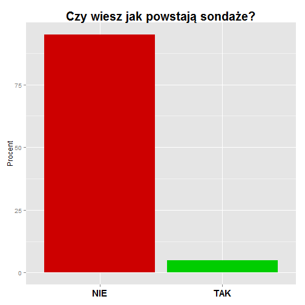

PogRomcy_Danych_NSS
========================================================

# 1. Wstêp
Z badañ przeprowadzonych przez zespó³ Na Stra¿y Sonda¿y w 2014 r. wynika, ¿e 95%
Polaków nie wie jak powstaj¹ sonda¿e!

### Wykres s³upkowy
 

### "Placek"
 

Jak interpretowaæ ten wynik? Co on oznacza? OdpowiedŸ jest prosta. Praktycznie nic, bo ta informacja nie ma ¿adnej wartoœci. Dlaczego? Nie tylko dlatego, ¿e jest zmyœlona. Podstawowy problem stanowi brak jakiejkolwiek noty metodologicznej: nie powiedzia³em dok³adnie kiedy zorganizowano badanie, jak¹ technik¹ je przeprowadzono (telefonicznie czy bezpoœrednio), jak zadano pytanie - co to znaczy, ¿e ktoœ wie jak powstaj¹ sonda¿e, a tak¿e nie zdefiniowa³em kim s¹ Polacy - czy s¹ to obywatele, czy mieszkañcy Polski, w jakim byli wieku. Nie poda³em równie¿ jakim b³êdem mog¹ byæ obarczone wyniki (tzw. b³¹d statystyczny), ani ile osób wziê³o udzia³ w badaniu. Codziennie w prasie i innych mediach pojawiaj¹ siê podobne “dane sonda¿owe”. Czy maj¹ one jak¹kolwiek wartoœæ? Czy mo¿na im zaufaæ? Jak odró¿niæ “dobry” sonda¿ od “z³ego”.
Na te oraz inne pytania postaramy siê udzieliæ odpowiedzi w trakcie naszego kursu. Poka¿emy na czym polega sonda¿, z jakich elementów siê sk³ada, jakie s¹ jago ograniczenia - czego nie powie nam nawet najlepsze badanie. Zaczniemy od przyk³adów ³atwych, a skoñczymy na bardziej zaawansowanych próbuj¹c wcieliæ siê na chwilê w rolê “sonda¿yst”. W imieniu zespo³u Na Stra¿y Sonda¿y zapraszamy do odkrywania niezwyk³ych mo¿liwoœci, ale tak¿e pewnych ograniczeñ metody zwanej reprezentacyjn¹, metody która stoi za wszystkimi sonda¿ami.

__Zadania 1:__  

  1. Wymieñ trzy artyku³y prasowe z 2014 r., w których powo³ano siê na wyniki badañ spo³ecznych (sonda¿y). Je¿eli w artykule podano tak¹ informacjê to napisz ile osób bra³o udzia³ w badaniu (ewentualnie ile firm lub innych instytucji je¿eli badanie nie dotyczy³o postaw ludzi)

L.p.          | Tytu³ artyku³u| Link do strony z artyku³em | Czy podano wielkoœæ próby? Zapisz j¹ je¿eli zosta³a podana | Czy podano dok³adn¹ datê realizacji badania? Jak¹?
------------- | --------------|----------------------------|----------------------------------------------------------------|-----------------------------------------------------
1.            |  Content Cell |                            |
2.            |  Content Cell |                            |
3.            |  Content Cell |                            |

# 2. Metoda reprezentacyjna

Na pierwszy rzut oka badanie sonda¿owe, badanie na próbie, mo¿e siê wydawaæ zadaniem karko³omnym. Oto na podstawie niewielkiej liczby obserwacji np. 1000 respondentów, staramy siê opisaæ du¿o wiêksz¹, czasami nawet o kilka rzêdów, populacjê. Czy ma to jakikolwiek sens? Czy da siê wyznaczyæ na tej podstawie przeciêtn¹ wagê, wzrost, miesiêczne wydatki, liczbê przeczytanych ksi¹¿ek albo czas spêdzany dziennie na facebooku przez doros³ych mieszkañców Polski. Trzeba wiedzieæ, ¿e oficjalnie mieszka oko³o 31 mln ludzi w wieku 18 i wiêcej lat. W tej sytuacji 1000 osób stanowi w zaokr¹gleniu trzy dziesiêciotysiêczne PROCENTA populacji (1 000 /31 000 000 = 0,000032)!!! To bardzo ma³o. Trudno uwierzyæ, ¿e taka garstka obserwacji mo¿e dostarczyæ nam wiarygodnych informacji o ca³ej badanej zbiorowoœci. Dla porównania zastanówmy siê, czy na podstawie jednego kilometra drogi da siê powiedzieæ, jak bêdzie wygl¹da³a ca³a podró¿ mierz¹ca 300 000 km (Ziemia w obwodzie liczy tylko 40 000 km). Na pierwszy rzut oka nie. Okazuje siê jednak, ¿e nauka, pod postaci¹ statystyki, daje nam pewne narzêdzia, które pozwalaj¹ trafnie wnioskowaæ o du¿ych “obiektach” nawet na podstawie ich niewielkiego wycinka. W przypadku podró¿y kluczem do sukcesu by³oby umiejêtne wybranie takich ma³ych odcinków z ca³ej drogi, które u³o¿¹ siê w próbny kilometr.
Statystycy i badacze spo³eczni wiedz¹ doskonale, ¿e dobrze dobrana próba stanowi œwietny opis ca³ej populacji. Jak to mo¿liwe? Co trzeba zrobiæ, ¿eby przy u¿yciu ma³ego kamyka dowiedzieæ siê czegoœ o wielkiej "górze"?

__Zadania 2:__      

  1. Wymieñ trzy badania na próbach przeprowadzone przez instytucje pañstwowe  i podaj link do ich wyników lub raportu. Mog¹ to byæ badania z roku 2014, ale tak¿e wczeœniejszych lat. 

L.p.          |Nazwa instytucji | Tytu³ badania  | Link do strony z raportem 
--------------|-----------------|----------------|----------------------------
1.            |  Content Cell   |                |
2.            |  Content Cell   |                |
3.            |  Content Cell   |                |

# 3. Przyk³ady prób

Zacznijmy od naszych codziennych doœwiadczeñ. Wbrew pozorom wiêkszoœæ naszej wiedzy o œwiecie czerpiemy z prób. I nie chodzi tu o metodê prób i b³êdów. Przyjrzyjmy siê naszemu zdrowiu. Czasami zdarza siê, ¿e lekarz ka¿e nam zrobiæ badanie krwi. Ale czy to oznacza, ¿e trzeba zbadaæ ca³¹ krew w organizmie, wszystkie komórki? Na szczêœcie nie. Wystarczy ma³a próbka. Lekarz pobiera od nas zaledwie 10 ml krwi. W ca³ym organizmie mamy jej a¿ 4,5l (4500ml). Tak wiêc próba stanowi 1/450. ca³ej objêtoœci krwi. To bardzo bardzo ma³o. Mimo to lekarz potrafi okreœliæ, co dzieje siê w ca³ym organizmie, a nie tylko w pobranej próbce. 
WeŸmy inny, mniej dramatyczny przyk³ad. WyobraŸmy sobie, ¿e chcemy ugotowaæ zupê i lubimy, gdy jest ona odpowiednio s³ona. Jak to sprawdzamy? Czy musimy wypiæ ca³¹ zupê z garnka? Absolutnie nie. Wystarczy jedna ³y¿eczka, która zawiera 15ml zupy i stanowi zaledwie 3/1000 piêciolitrowego garnka. Znowu dobraliœmy niewielk¹ próbkê, ¿eby zbadaæ wiêksz¹ ca³oœæ. Ale przypadek zupy jest szczególny. ¯eby przekonaæ siê, czy zupa jest odpowiednio s³ona, musimy j¹ najpierw dobrze WYMIESZAÆ. Tylko wtedy proporcja soli w ³y¿ce zupy, bêdzie taka sama jak proporcja w ca³ym garnku - ³y¿ka zupy bêdzie dobrze reprezentowaæ ca³¹ zupê. Kluczow¹ kwesti¹ jest wiêc REPREZENTATYWNOŒÆ PRÓBY.  Na pewno niektórzy s³yszeli ju¿ to pojêcie. Zapamiêtajmy je na chwilê, chocia¿ póŸniej bêdziemy musieli z niego zrezygnowaæ. Reprezentatywnoœæ mo¿na rozumieæ na ró¿ne sposoby. Czêsto mówi siê, ¿e tak jak w przypadku ³y¿ki zupy, próba musi byæ “miniatur¹” populacji. Innymi s³owy powinna odtwarzaæ strukturê i zale¿noœci obserwowane w ca³ej zbiorowoœci. W przypadku badania krwi lub zupy brzmi to sensownie. Zauwa¿my jednak, ¿e badane substancje s¹ “jednorodne”. Ka¿da porcja zupy czy krwi jest w³aœciwie identyczna (dla uproszczenia, bo specjaliœci z pewnoœci¹ powiedz¹, ¿e to nie jest takie proste). A co jeœli badana zbiorowoœæ nie jest i nie mo¿e byæ jednorodna? To problem, z którym bardzo czêsto mierz¹ siê nauki spo³eczne.

__Zadania 3:__      

  1. Podaj przyk³ad z ¿ycia codziennego badania na próbie (np. badanie iloœci soli w zupie). 

L.p.          |Czego dotyczy badanie? | Co jest prób¹?  
--------------|-----------------------|----------------
1.            |  Opis badania         | Opis próby          
2.            |  Opis badania         | Opis próby      
3.            |  Opis badania         | Opis próby      

# 4. Sonda¿ 

PrzejdŸmy do badañ spo³ecznych i tzw.  sonda¿y politycznych. Ich wyniki czêsto pojawiaj¹ siê w prasie i maj¹ du¿e znaczenie dla polityków oraz pewnie trochê mniejsze dla wyborców.  WyobraŸmy sobie, ¿e chcemy zmierzyæ poziom poparcia dla wybranej partii P w wyborach do parlamentu. Dla naszych celów ods³oñmy kilka faktów dotycz¹cych badanej zbiorowoœci:

       | Nie biorê udzia³y w wyborach | NIE |  Tak | Razem
-------|------------------------------|-----|------|-------
Miasto | 30                           | 5   | 25   | 60
Wies   | 20                           | 10  | 10   | 40
RAZEM  | 50                           | 15  | 35   | 100

W powy¿szej tabeli umieœciliœmy procentowy rozk³ad dwóch cech w populacji pe³noletnich  mieszkañców Polski (dane fikcyjne). Pierwsz¹ cech¹ jest miejsce zamieszkania (w wierszach), a drug¹ poparcie dla partii P (w kolumnach). Widzimy, ¿e w miastach mieszka 60% ludnoœci, a na wsi 40%. £¹cznie w ca³ej zbiorowoœci (RAZEM) 35% obywateli zag³osowa³oby na partiê P, 15% na inn¹ partiê, a 50% w ogóle nie wziê³oby udzia³u w wyborach. Mo¿emy równie¿ powiedzieæ, ¿e osoby mieszkaj¹ce w mieœcie i popieraj¹ce partiê P stanowi¹ 25% ogó³u  uprawnionych do g³osowania, a tak¿e ¿e osoby które mieszkaj¹ na wsi i nie bior¹ udzia³u w wyborach stanowi¹ 20% populacji. Oczywiœcie, w normalnych warunkach tego typu informacje s¹ niedostêpne dla badacze. My je “ods³aniamy” potrzeby kursu. 
 
Zastanówmy siê jak z powy¿szej populacji dobraæ próbê reprezentatywn¹, aby móc trafnie na jej podstawie oceniæ, jaki procent mieszkañców Polski popiera partiê P?
I tu pojawia siê pierwszy problem. Nie da siê bowiem “wymieszaæ” obywateli tak jak zupy. Zbiorowoœæ nie jest jednorodna. Preferencje wœród mieszkañców miast i wsi nie s¹ identyczne. Nie ma wiêc gwarancji, ¿e jeœli id¹c ulic¹ w mieœcie lub na wsi zapytamy dowolnych 10 osób o ich preferencje partyjne to bêdziemy mogli powiedzieæ jakie jest poparcie w ca³ym kraju. W uproszczeniu w mieœcie 4 na 10 osób zag³osowa³oby na partiê P (bo 25%/60%???0,4), a na wsi 1 na 4 (bo 10%/40%=0,25). W pierwszym przypadku poparcie bêdzie zawy¿one, a w drugim zani¿one, w stosunku do ogólnokrajowych wyników (35%). Widaæ wiêc, ¿e nie ka¿da próba bêdzie “REPREZENTATYWNA”. I tu zatrzymajmy siê znowu przy definicji REPREZENTATYWNOŒCI. Zauwa¿my, ¿e zale¿y nam na tym, aby wynik z próby by³ zgodny z tym co obserwujemy w populacji. Czyli w zasadzie nie musi byæ tak, ¿e próba jest miniatura populacji. Wa¿niejsze jest to, ¿e na jej podstawie prawid³owo odgadujemy wyniki dla ca³ej zbiorowoœci.
¯eby przeprowadziæ nasz polityczny sonda¿ musimy zrealizowaæ badanie zarówno na wsi jak i w mieœcie. Ka¿da osoba nale¿¹ca do populacji musi mieæ szansê znalezienia siê w próbie. To bardzo wa¿ne. Sposób dobierania próby, zwany schematem, nie mo¿e uniemo¿liwiaæ nikomu znalezienia siê w próbie. 
W dalszej czêœci kursu poka¿emy jak prawid³owo zdefiniowaæ populacjê, jak b³êdy w kwestionariuszu mog¹ wp³yn¹æ na zachowanie respondentów, jak dobraæ, a dok³adnie wylosowaæ próbê reprezentatywn¹, 

__Zadania 4:__      

  1. Czy w przypadku badania populacji mieszkañców Polski, wyniki sondy ulicznej przeprowadzonej w Warszawie, Krakowie lub Poznaniu mo¿na uznaæ za wiarygodne (daj¹ce siê uogólniæ na ca³¹ populacjê)?
  2. Na podstawie danych z Tabeli 1. POPULACJA WYBORÓW odpowiedz na poni¿sze pytania:     
    a. Jaki procent mieszkañców wsi popiera partiê P?    
    b. Jaki procent mieszkañców miasta nie pójdzie na wybory?    
    c. Jaki procent osób które nie popieraj¹ partii P mieszka w mieœcie?

# 5. Problem badawczy: populacja i próba 

W reprezentacyjnych badaniach sonda¿owych kluczowymi terminami s¹ __populacja__ i __próba__.
Populacja jest to zbiorowoœæ, o której badacz chce zdobyæ informacje na podstawie sonda¿u. Przyk³adami populacji mog¹ byæ  mieszkañcy Krakowa, Gdyni, uczniowie wszystkich szkó³ gimnazjalnych lub pe³noletni mieszkañcy Polski, nie tylko obywatele.
Próba jest to zbiór jednostek wybranych z populacji, o której badacz chce zdobyæ informacje. Problem ze zdefiniowaniem tych dwóch pojêæ dobrze ilustruje przyk³ad z historii.  W 1936 roku „Literary Digest”, popularny magazyn informacyjny przeprowadzi³ w USA badanie przedwyborcze. Do ludzi wybranych z ksi¹¿ek telefonicznych i list rejestracyjnych samochodów wys³ano DZIESIÊÆ MILIONÓW kart pocztowych, pytaj¹c, na kogo zamierzaj¹ oddaæ g³os w wyborach prezydenckich – na republikanina Alfa Landona czy demokratê Franklina Roosevelta? Odpowiedzia³o ponad dwa miliony ludzi, wskazuj¹c ¿e nowym prezydentem wybrany zostanie Alf Landon (57%), a nie Franklin Roosevelt (43%). Mog³oby siê wydawaæ, ¿e przebadanie tylu osób jest du¿o bardziej wiarygodne i miarodajne ni¿ przeprowadzenie badania na niewielkim wycinku populacji. Nic bardziej mylnego. Realne wybory doœæ drastycznie zweryfikowa³y wnioski z tych badañ – nowym prezydentem zosta³ Franklin Roosevelt, maj¹c najwiêksz¹ przewagê g³osów w historii – otrzyma³ 61%.
Dla porównania w tym samym czasie przedwyborczy sonda¿, przeprowadzi³ równie¿  George Gallup, który trafnie przewidzia³ wyniki wyborów. W swoim badaniu pos³u¿y³ siê on jednak niewielk¹ prób¹ kwotow¹ (czyli opart¹ na znajomoœci okreœlonych cech populacji, np. p³eæ, dochód, wiek, miejsce zamieszkania itp.).
Na czym wiêc polega³ problem? Na ca³kowitym braku kontroli nad badan¹ prób¹. Na pytanie zadane przez „Literary Digest” odpowiedzia³o zaledwie 22% wszystkich zapytanych osób. Jak siê okaza³o karty w wiêkszoœci odsy³ali republikanie. Drugi problem polega³ na nieprawid³owym zdefiniowaniu populacji. Respondenci do badania zostali dobrani na podstawie spisu abonentów telefonicznych i w³aœcicieli samochodów. Taka konstrukcja próby dawa³a nadreprezentacjê zamo¿nych wyborców, czyli pominiêcie ludzi biednych, którzy w wiêkszoœci g³osowali na „New deal” Roosevelta. 
Przyk³ad ten ilustruje, jak dobór nawet du¿ej próby z niepoprawnie zdefiniowanej populacji mo¿e doprowadziæ do zupe³nie nietrafnych wniosków.  Analizuj¹c wyniki badañ sonda¿owych nale¿y zawsze zwracaæ uwagê na sposób definiowania populacji. Definicja zbiorowoœci generalnej powinna zawieraæ informacje o: 

* po³o¿eniu w przestrzeni zbiorowoœci (mieszkañcy Polski, mieszkañcy Poznania itp.)  
* wieku respondentów (pe³noletni Polacy, osoby w wieku 15 i wiêcej ukoñczonych lat itp.)   
* inne cechy (osoby posiadaj¹ce obywatelstwo polskie, osoby z wykszta³ceniem wy¿szym itp.)

__Zadania 5:__      

  1. Wymieñ trzy firmy zajmuj¹ce siê badaniem rynku i opinii spo³ecznej, które w 2014 r. prowadzi³y badania sonda¿owe w Polsce i podaj link do strony z raportami badawczymi tej firmy: 
  
L.p.          | Nazwa firmy badawczej| Link do strony z raportem?  
--------------|----------------------|----------------
1.            |  Nazwa firmy         | Raport          
2.            |  Nazwa firmy         | Raport     
3.            |  Nazwa firmy         | Raport     

  2. Masz nastêpuj¹cy problem badawczy. Musisz zbadaæ poziom czytelnictwa tygodnika Na Stra¿y Sonda¿y. Ukazuje siê wy³¹cznie w formie drukowanej w miastach wojewódzkich (siedzibach wojewody). Pismo jest przeznaczone dla wszystkich, niezale¿nie od wykszta³cenia czy wieku.   
    a. Jak zdefiniujesz czytelnictwo? ( Pytania pomocnicze: Kiedy ktoœ staje siê czytelnikiem? Jak czêsto trzeba czytaæ ¿eby staæ siê czytelnikiem? Ile trzeba przeczytaæ ¿eby staæ siê czytelnikiem?)   
    b. Jak zdefiniujesz populacjê czytelników? (Pytania pomocnicze: jaki jest minimalny wiek czytelnika? czy czytelnicy mieszkaj¹ tylko w miastach wojwódzkich czy tak¿e w innych miejscach?)   
    c. Zapisz pytanie o czytelnictwo (maksymalnie dwa zdania):........    
    d. Czy twoim zdaniem pytanie o czytelnictwo mo¿e byæ uznane za dra¿liwe?
  3. W 2013 r. Dom Badawczy Maison przygotowa³a na zlecenie Polskiej Fundacji Pomocy Dzieciom „Maciuœ” raport pt.:“G³ód i niedo¿ywienie dzieci w Polsce”. Zosta³ on przygotowany na podstawie badanie przeprowadzono telefonicznie (technika CATI - Computer Assisted Telephone Interview) na ogólnopolskiej, reprezentatywnej próbie 800 przedstawicieli instytucji zajmuj¹cych siê dzieæmi i ich sytuacj¹ ¿yciow¹. Z raportu wynika, ¿e pracownicy szkó³ i pracownicy OPS/PCPR szacuj¹, ¿e co dziesi¹te dziecko z klas 1–3 dotyka problem niedo¿ywienia.   
    a. Zdefiniuj badan¹ populacjê.
    b. Podaj liczbê uczniów klas 1-3 w Polsce w 2013 r.(mog¹ to byæ dane zgodne ze stanem na 1 czerwca 2013 r. lub dla póŸniejszej daty przed koñcem 2013 r.)
    c. Maksymalnie w trzech zdaniach napisz co rozumiesz przez niedo¿ywienie
    d. Czy z danych przedstawionych w raporcie mo¿e wynikaæ, ¿e w Polsce z g³odu cierpi oko³o 800 000 dzieci? OdpowiedŸ uzasadnij.
    
# 6. Kwestionariusz

_Dlaczego dziennikarze powinni informowaæ o sposobie zadania pytania (z przytoczeniem dok³adnego jego brzmienia, ale to oddzielny temat) pokazuje klasyczne ju¿ badanie opisywane przez Schumana [3], zrealizowane w 1986 roku w Stanach Zjednoczonych. Badacze z Uniwersytetu Michigan zapytali o najwa¿niejsze wydarzenia lub zmiany, jakie zasz³y w ostatnich 50 latach i wydaj¹ siê respondentom najbardziej istotne. Po³owa ankietowanych mia³a do dyspozycji kafeteriê: II wojna œwiatowa, podbój kosmosu, zabójstwo J. F. Kennedy’ego, wynalezienie komputera, wojna w Wietnamie, inne, nie wiem. Druga po³owa otrzyma³a pytanie otwarte, a wiêc sama proponowa³a odpowiedzi. Wœród tej grupy wynalezienie komputera zosta³o wskazane jako najbardziej istotne wydarzenie lub zmiana przez 1% badanych, podczas gdy w pierwszej po³owie ankietowanych by³a to najczêœciej wybierana odpowiedŸ (30%). Tak ogromna ró¿nica wydaje siê wystarczaj¹co dobitnie pokazywaæ, jakie znaczenie ma forma zadanego pytania._ 

_Badacze spo³eczni doskonale wiedz¹, ¿e umieszczanie jakiejkolwiek nazwy instytucji czy organizacji w treœci pytania znacznie zniekszta³ca wyniki. Jest to potwierdzone wieloma testami i badaniami socjologicznymi oraz psychologicznymi, a studia przypadków s¹ szeroko opisywane w literaturze naukowej[2]. Formu³owane pytania powinny odnosiæ siê do rzeczywistoœci jak najbardziej neutralnie_

    
__Zadania 5:__      

  1.  Odpowiedz na pytania zwi¹zane z nastêpuj¹cym badaniem: Firmê Research.NK przygotowa³a w 2013 r. raport „Prezentacja treœci seksualnych przez m³odzie¿ poprzez wideoczaty” dla Naukowej Akademickiej Sieci Komputerowej. Dane zosta³y zebrane od respondentów przez Internet. Próba liczy³a 976 nastolatków - osób w wieku 13-16 lat. Spoœród nich  528  zdeklarowa³o, ¿e korzysta z wideo rozmów. W tej grupie 10 osób zadeklarowa³o, ¿e  rozbiera siê w sieci na ¿ywo (Pytanie brzmia³o: „Czy zdarzy³o Ci siê rozbieraæ siê lub prezentowaæ zachowania seksualne podczas wideorozmowy?” ). Wiadomo równie¿, ¿e w badaniu wziê³o udzia³ 157 szesnastolatków, z czego 96 z nich korzysta z wideo rozmów, a 5 deklaruje rozbieranie siê w czasie . 
    a. Czy uwa¿asz, ¿e respondenci generalnie (a wiec przyt³aczaj¹ca wiêkszoœæ z nich) udzielali szczerych (zgodnych ze stanem faktycznym), odpowiedzi na pytanie o to, czy rozbierali siê w trakcie wideoczatów - zarówno Ci którzy przyznali siê do tego typu zachowañ jak i ci którzy ich nie potwierdzili?  
      i. Tak - generalnie odpowiadali szczerze;   
      ii. Nie - generalnie odpowiadali nieszczerze;   
      iii. Nikt tego nie wie. Mo¿e czêœæ tak, a czêœæ nie.   
      iv. Jestem dzielna/y i napiszê jakie jest moje w³asne zdanie na ten temat : ...  
    b. Czy uwa¿asz, ¿e badanie przez Internet daje wiêksze poczucie anonimowoœci ni¿ klasyczne badania prowadzone przez telefon lub twarz¹ w twarz z ankieterem? Uzasadnij maksymalnie w trzech zdaniach.
      i. Tak, poniewa¿ ...
      ii. Nie. poniewa¿ ...
    c. Czy uwa¿asz, ¿e badanie przez Internet daje wiêksze poczucie anonimowoœci ni¿ klasyczne badania prowadzone przez telefon lub twarz¹ w twarz z ankieterem? Uzasadnij maksymalnie w trzech zdaniach.   
      i. Tak, poniewa¿ ...   
      ii. Nie. poniewa¿ ...    
    d. Czy w badaniu przeprowadzonym przez internet by³abyœ / by³byœ sk³onny odpowiadaæ szczerze na pytania dotycz¹ce seksualnoœci, chorób intymnych lub ³amania prawa? Dlaczego? (Pytania pomocnicze: zastanów siê, czy wa¿na w tych kwestiach jest anonimowoœæ i poufnoœæ danych, a tak¿e, czy w ogóle mówienie na ten temat sprawia Ci jakieœ problemy):
      i. Tak, poniewa¿ ...    
      ii. Nie, poniewa¿ ...    
    e. Jaki procent nastolatków w powy¿szym badaniu zadeklarowa³, ¿e korzysta z wideo rozmów i rozbiera siê w ich trakcie?
    f. Jaki procent osób które zadeklarowa³y, ¿e rozbieraj¹ siê w trakcie wideoczatów do 16 latkowie?    
    g. Jaki procent nastolatków, którzy korzystaj¹ z wideo rozmów zadeklarowa³, ¿e siê rozbiera w ich trakcie?    
    h. Czy znaj¹c wyniki badania zgodzi³abyœ/zgodzi³byœ siê z nastêpuj¹cymi okreœleniami:    
      i. „Nowa plaga w sieci. Rozbieraj¹ siê na ¿ywo” - TAK / NIE    
      ii. „Nagie gimnazjalistki w sieci. Nowa plaga w internecie” - TAK / NIE    
      iii. “Nowe zjawisko w internecie. Gizmazjaliœci rozbieraj¹ siê w sieci” - TAK / NIE     
      i.v “Uwaga na wideoczaty. Niektóre nastolatki wystêpuj¹ nago”    
  1.  Poni¿ej znajduj¹ siê dwa sonda¿e. Wype³ni³ je i odpowiedz na pytania:   
    a. Sonda¿ 1:   
      i. Czy gdyby wybory odby³y siê w najbli¿sz¹ niedzielê to wzi¹³by(ê³aby) Pan(i) w nich udzia³?   
      ii. Je¿eli tak, to na jak¹ jedn¹ partiê oda³by Pan(i) g³os?   
        1. oddam pusty/niewa¿ny g³os;    
        2. partiê P;   
        3. partiê Przyjació³ Demokracji;  
        4. partiê Przyjació³ Otwartoœci;   
        5. partiê Przyjació³ Spo³eczeñstwa;   
        6. partiê Przyjació³ Œrodowiska;   
        7. partiê Przyjació³ Uczciwoœci;   
    b. Sonda¿ 2.
      i. Proszê okreœliæ czy zgadza siê Pan/Pani z nastêpuj¹cymi stwierdzeniami:    
        1. Podatki w Polsce s¹ za wysokie i nale¿y je niezw³ocznie obni¿yæ   
        2. ZUS jest organizacj¹ drog¹, nieefektywn¹ i marnuj¹c¹ publiczne pieni¹dze    
        3. Obywatele lepiej bêd¹ zarz¹dzaæ swymi pieniêdzmi ni¿ urzêdnicy w ich imieniu    
        4. ka¿da rodzina powinna móc liczyæ na wsparcie ze strony pañstwa.     
      ii. Czy s³ysza³(a) Pan(i) o powstaniu nowej partii “P”, której programem jest m. in. obni¿enie podatków, ograniczenie obci¹¿eñ biurokratycznych, zmniejszenie liczby urzêdników oraz wsparcie dla rodzin?   
      iii. Czy gdyby partia “P” bra³a udzia³ w najbli¿szych wyborach do Sejmu to jak¹ jedn¹ partiê odda³by Pan(i) g³os?
oddam pusty/niewa¿ny g³os;
        1. oddam pusty/niewa¿ny g³os;    
        2. partiê P;   
        3. partiê Przyjació³ Demokracji;  
        4. partiê Przyjació³ Otwartoœci;   
        5. partiê Przyjació³ Spo³eczeñstwa;   
        6. partiê Przyjació³ Œrodowiska;   
        7. partiê Przyjació³ Uczciwoœci;  
    c. Pytanie do sonda¿y 1. oraz 2.:     
      i. Czy w obu sonda¿ach udzieli³aœ/eœ takiej samej odpowiedzi?    
      ii. Czy twoim zdaniem kolejnoœæ pytañ w sonda¿u 1. 2. mo¿e mieæ wp³yw na odpowiedzi respondentów?    
      
# 7. Dobór próby

PrzejdŸ do najbardziej technicznej czêœci sonda¿u, a wiec doboru próby i realizacji badania. W bran¿y sonda¿owej korzysta siê z ró¿nych rozwi¹zañ i nie zawsze s¹ to próby losowe mimo i¿ wiadomo, ¿e s¹ one obarczone pewnymi b³êdami. Dlatego my zajmiemy siê metod¹ reprezentatywn¹, a wiêc próbami losowymi. 

Wróæmy do naszej populacji, która pojawi³a siê w rozdziale 4. Sonda¿. Za³ó¿my, ¿e badana zbiorowoœæ sk³ada siê z 20 osób wœród których preferencje i miejsce zamieszkania rozk³adaj¹ siê w nastêpuj¹cy sposób (rozk³ad procentowy jest dok³adnie taki jak w Tabeli 1. POPULACJA WYBORÓW (dane w procentach)):

### Tabela 7.1. POPULACJA WYBORÓW (liczba obserwacji)

       | Nie biorê udzia³y w wyborach | NIE |  Tak | Razem
-------|------------------------------|-----|------|-------
Miasto | 6                            | 1   |  5   | 12
Wies   | 4                            | 2   |  2   | 8
RAZEM  | 10                           | 3   |  7   | 20

Z powy¿szej tabeli wynika, ¿e w miastach mieszka 12 osób, a na wsi 8. Poparcie dla partii P deklaruje 7 osób, poparcie dla innych partii 3, a na wybory w ogóle nie pójdzie 10 osób. W za³¹czonym pliku znajduje siê lista zawieraj¹ca dane o wszystkich osobach nale¿¹cych do populacji:

https://docs.google.com/spreadsheets/d/1iSt2ZD9F8DhEh8UonnYqZ71wG7gqm5MSlpiZM2vL-Gw/pubhtml?gid=1189066294&single=true

Kolejne kolumny w pliku to:   

  * L.p.- liczba porz¹dkowa 
  * Miasto_wies - miejsce zamieszkania
    + M - miasto
    + W - wieœ
  * Glosowanie - czy pójdziesz na wybory i na kogo zag³osujesz
    + -1 - nie pójdê na wybory
    + 0 - pójdê na wybory, ale NIE zag³osujê na partiê P
    + 1 - pójdê na wybory i zag³osujê na partiê P.
    
PrzejdŸmy do badania sonda¿owego. Za³ó¿my, ¿e chcemy oszacowaæ nieznany nam odsetek obywateli nie pójdzie na wybory (na chwilê zapomnijmy, ¿e wynosi on 50%). Interesuj¹ nas wartoœci -1 w kolumnie “Glosowanie”. la uproszczenia, losujemy dwie ró¿ne osoby spoœród wszystkich 20 obywateli. Dobór próby przebiega wg. nastêpuj¹cego schematu:

  1. Do próby losujemy jedn¹ osobê spoœród wszystkich 20. Ka¿dy obywatel ma takie samo prawdopodobieñstwo znalezienia siê w próbie - wynosi ono 1/20;   
  2. Spoœród pozosta³ych 19 osób znowu losujemy jednego respondenta. Ponownie w zbiorowoœci z której dobierany jest respondent ka¿dy ma takie samo prawdopodobieñstwo znalezienia siê w próbie - wynosi on tym razem 1/19;    
  3. Otrzymujemy próbê, w której znajduj¹ siê dwie osoby. Poza prób¹ zostaje 18 obywateli.   

Powy¿szy schamat losowania nazwiemy fachowo: losowaniem prostym bez zwracania 2 osób z populacji 20. Losowanie jest proste poniewa¿ na ka¿dym etapie wszyscy obywatele pozostaj¹cy w populacji maj¹ takie samo prawdopodobieñstwo dostania siê do próby. Bez zwracania poniewa¿ po wylosowaniu jednej osoby do próby nie wraca ona do puli z której losujemy nastêpn¹. Ten bardzo prosty schemat losowania próby pozwali nam przeanalizowaæ pewne podstawowe zagadnienia zwi¹zane z metod¹ reprezentacyj¹. Zastanówmy siê przede wszystkim, jak bêd¹ wygl¹da³y dobierane próby. Jako identyfikatora osób w próbie wykorzystamy liczby z kolumny L.p. z listy zawieraj¹cej wszystkich obywateli naszej populacji. Zapis (1,2) oznaczaæ bêdzie, ¿e do próby wylosowano najpierw osobê o liczbie porz¹dkowej 1, a nastêpnie osobê o liczbie porz¹dkowej 2. Próby mo¿emy wiêc rozpisaæ wg. prostej regu³y. Je¿eli do próby w pierwszym kroku dobierzemy osobê o liczbie porz¹dkowej 1 to w drugim kroku do pary mo¿emy dobraæ osoby z liczb¹ 2, 3, 4, 5, …lub 20. W ten sposób otrzymamy próby: (1,2), (1,3), (1,4), (1,5), ... lub (1,20). Je¿eli do próby w pierwszym kroku dobierzemy osobê o liczbie porz¹dkowej 2 to w drugim kroku do pary mo¿emy dobraæ osoby z liczb¹ 1, 3, 4, 5, …lub 20. W ten sposób otrzymamy próby: (2,1), (2,3), (2,4), (2,5), ... lub (2,20). Widzimy wiêc, ¿e dla ka¿dej z 20 osób w populacji mo¿emy dobraæ 19 ró¿nych par. £¹cznie mo¿emy wiêc dobraæ 20x19=380 dwuosobowych prób. Rozpiszmy je (__poni¿szy fragment zostanie wygenerowany w R__):  
(1,2); (1,3); (1,4); (1,5); (1,6); (1,7); (1,8); (1,9); (1,10); (1,11); (1,12); (1,13); (1,14); (1,15); (1,16); (1,17); (1,18); (1,19); (1,20); (2,1); (2,3); (2,4); (2,5); (2,6); (2,7); (2,8); (2,9); (2,10); (2,11); (2,12); (2,13); (2,14); (2,15); (2,16); (2,17); (2,18); (2,19); (2,20); (3,1); (3,2); (3,4); (3,5); (3,6); (3,7); (3,8); (3,9); (3,10); (3,11); (3,12); (3,13); (3,14); (3,15); (3,16); (3,17); (3,18); (3,19); (3,20); (4,1); (4,2); (4,3); (4,5); (4,6); (4,7); (4,8); (4,9); (4,10); (4,11); (4,12); (4,13); (4,14); (4,15); (4,16); (4,17); (4,18); (4,19); (4,20); (5,1); (5,2); (5,3); (5,4); (5,6); (5,7); (5,8); (5,9); (5,10); (5,11); (5,12); (5,13); (5,14); (5,15); (5,16); (5,17); (5,18); (5,19); (5,20); (6,1); (6,2); (6,3); (6,4); (6,5); (6,7); (6,8); (6,9); (6,10); (6,11); (6,12); (6,13); (6,14); (6,15); (6,16); (6,17); (6,18); (6,19); (6,20); (7,1); (7,2); (7,3); (7,4); (7,5); (7,6); (7,8); (7,9); (7,10); (7,11); (7,12); (7,13); (7,14); (7,15); (7,16); (7,17); (7,18); (7,19); (7,20); (8,1); (8,2); (8,3); (8,4); (8,5); (8,6); (8,7); (8,9); (8,10); (8,11); (8,12); (8,13); (8,14); (8,15); (8,16); (8,17); (8,18); (8,19); (8,20); (9,1); (9,2); (9,3); (9,4); (9,5); (9,6); (9,7); (9,8); (9,10); (9,11); (9,12); (9,13); (9,14); (9,15); (9,16); (9,17); (9,18); (9,19); (9,20); (10,1); (10,2); (10,3); (10,4); (10,5); (10,6); (10,7); (10,8); (10,9); (10,11); (10,12); (10,13); (10,14); (10,15); (10,16); (10,17); (10,18); (10,19); (10,20); (11,1); (11,2); (11,3); (11,4); (11,5); (11,6); (11,7); (11,8); (11,9); (11,10); (11,12); (11,13); (11,14); (11,15); (11,16); (11,17); (11,18); (11,19); (11,20); (12,1); (12,2); (12,3); (12,4); (12,5); (12,6); (12,7); (12,8); (12,9); (12,10); (12,11); (12,13); (12,14); (12,15); (12,16); (12,17); (12,18); (12,19); (12,20); (13,1); (13,2); (13,3); (13,4); (13,5); (13,6); (13,7); (13,8); (13,9); (13,10); (13,11); (13,12); (13,14); (13,15); (13,16); (13,17); (13,18); (13,19); (13,20); (14,1); (14,2); (14,3); (14,4); (14,5); (14,6); (14,7); (14,8); (14,9); (14,10); (14,11); (14,12); (14,13); (14,15); (14,16); (14,17); (14,18); (14,19); (14,20); (15,1); (15,2); (15,3); (15,4); (15,5); (15,6); (15,7); (15,8); (15,9); (15,10); (15,11); (15,12); (15,13); (15,14); (15,16); (15,17); (15,18); (15,19); (15,20); (16,1); (16,2); (16,3); (16,4); (16,5); (16,6); (16,7); (16,8); (16,9); (16,10); (16,11); (16,12); (16,13); (16,14); (16,15); (16,17); (16,18); (16,19); (16,20); (17,1); (17,2); (17,3); (17,4); (17,5); (17,6); (17,7); (17,8); (17,9); (17,10); (17,11); (17,12); (17,13); (17,14); (17,15); (17,16); (17,18); (17,19); (17,20); (18,1); (18,2); (18,3); (18,4); (18,5); (18,6); (18,7); (18,8); (18,9); (18,10); (18,11); (18,12); (18,13); (18,14); (18,15); (18,16); (18,17); (18,19); (18,20); (19,1); (19,2); (19,3); (19,4); (19,5); (19,6); (19,7); (19,8); (19,9); (19,10); (19,11); (19,12); (19,13); (19,14); (19,15); (19,16); (19,17); (19,18); (19,20); (20,1); (20,2); (20,3); (20,4); (20,5); (20,6); (20,7); (20,8); (20,9); (20,10); (20,11); (20,12); (20,13); (20,14); (20,15); (20,16); (20,17); (20,18); (20,19);
Powy¿ej znajduj¹ siê wszystkie mo¿liwe 380 dwuosobowe próby otrzymane wg. wczeœniej opisanego schematu.  Widzimy, ¿e niektóre pary w próbach siê powtarzaj¹. Mo¿emy bowiem wylosowaæ najpierw osobê o nr 1, a potem osobê numer 2. Otrzymujemy wtedy próbê (1,2). Lub na odwrót. Najpierw wylosujemy osobê numer 2. a potem osobê nr 1. Otrzymujemy wtedy próbê (2,1). Nasuwa siê pytanie, w ilu próbach znajdzie siê ka¿dy obywatel.
